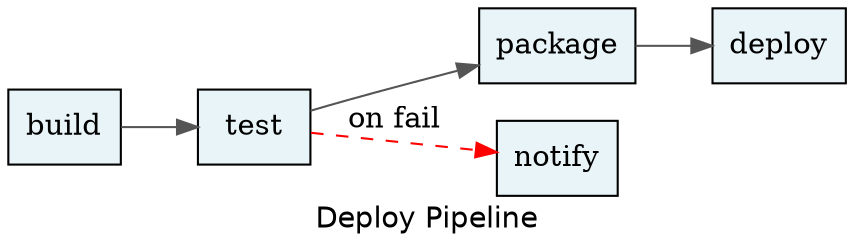
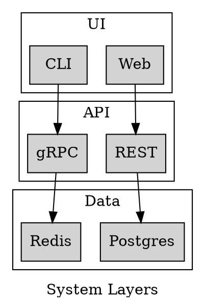
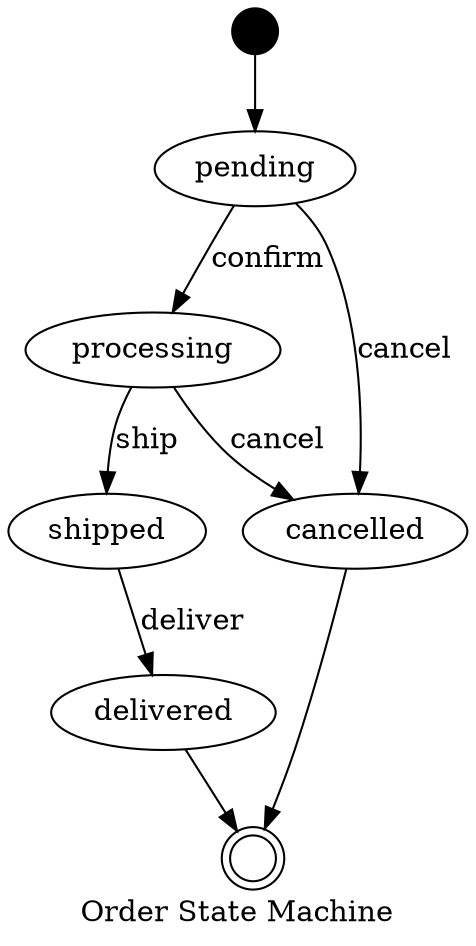

# DOT Instructions

Mid-weight reference for DOT/Graphviz authoring. Load via @mention when detailed syntax guidance is needed.

## DOT Syntax Quick Reference

### Graph Declarations

```dot
digraph G { /* directed graph */ }
graph G { /* undirected graph */ }
strict digraph G { /* no duplicate edges */ }
```

### Nodes — Attributes & ID Rules

```dot
// Quoted IDs for spaces or special chars; snake_case preferred otherwise
A [label="My Node", shape=box, style=filled, fillcolor=lightblue]
"my node" [shape=ellipse, color=red]
```

### Edges — Directed, Chain, Fan-Out, Styled

```dot
A -> B                                        // directed
A -> B -> C -> D                              // chain
A -> {B C D}                                  // fan-out
A -> B [color=red, style=dashed, label="err"] // styled
A -- B                                        // undirected (graph only)
```

### Attributes — Graph/Node/Edge Defaults & Per-Element Overrides

```dot
digraph G {
  graph [label="Title", fontname="Helvetica", rankdir=LR]
  node  [shape=box, style=filled, fillcolor="#f5f5f5"]
  edge  [color="#666666", arrowsize=0.8]
  A [fillcolor="#ffe8d8"]  // per-element override
}
```



### Subgraphs & Clusters

```dot
// Cluster border rendered only when name starts with cluster_
subgraph cluster_api {
  label="API Layer"; style=filled; fillcolor="#e8f4f8"
  A; B
}
subgraph group1 { A; B }  // no border rendered
```

### HTML Labels — TABLE/TR/TD and PORT Connections

```dot
A [label=<<TABLE BORDER="0" CELLBORDER="1">
    <TR><TD PORT="in">IN</TD><TD>Node A</TD><TD PORT="out">OUT</TD></TR>
  </TABLE>>]
A:out -> B:in  // PORT-based connections
```

### Comments

```dot
// C++ single-line comment
/* C multi-line
   comment */
# Hash-style comment (also valid in DOT)
```

---

## Common Shape Vocabulary

| Shape            | Use Case                          |
|------------------|-----------------------------------|
| `box`            | Process, service, step            |
| `box` + rounded  | Softer process / module           |
| `ellipse`        | Data, state, generic node         |
| `diamond`        | Decision, branch point            |
| `cylinder`       | Database, storage                 |
| `folder`         | Package, group, namespace         |
| `circle`         | Start state (FSM)                 |
| `doublecircle`   | Terminal / accept state (FSM)     |
| `note`           | Annotation, callout, caveat       |
| `component`      | Software component (UML-style)    |
| `tab`            | Document, file, artifact          |
| `hexagon`        | Preparation step (flowchart)      |

---

## Layout Engine Selection

| Engine  | Best For                       | Characteristic                   |
|---------|--------------------------------|----------------------------------|
| `dot`   | Directed hierarchies, DAGs     | Top-down or left-right layering  |
| `neato` | Small undirected graphs        | Spring-model (energy-based)      |
| `fdp`   | Larger undirected graphs       | Force-directed, cluster-aware    |
| `sfdp`  | Very large graphs (1k+ nodes)  | Scalable force-directed          |
| `circo` | Circular / ring topologies     | Nodes arranged on a circle       |
| `twopi` | Radial / hub-and-spoke         | Radial tree from a root node     |

---

## Quality Gates

### Line Count Targets

| Diagram Type | Recommended | Maximum |
|--------------|-------------|---------|
| Overview     | 100–200     | 250     |
| Detail       | 150–300     | 400     |
| Inline       | 10–40       | 60      |

### Required Elements for Diagrams > 20 Nodes

- **Title** — set `label` attribute on the graph declaration
- **Legend** — explicit `cluster_legend` subgraph explaining symbol meanings
- **Clusters** — group related nodes with `cluster_` subgraphs
- **Consistent node IDs** — use `snake_case` or `UPPER_SNAKE`; never ad-hoc strings

### Legend Pattern

```dot
subgraph cluster_legend {
  label="Legend"; style=filled; fillcolor=white
  l1 [label="Service",  shape=box,      style=filled, fillcolor=lightblue]
  l2 [label="Database", shape=cylinder]
  l3 [label="Decision", shape=diamond]
  l1 -> l2 [style=invis]
  l2 -> l3 [style=invis]
}
```

---

## Anti-Patterns

| Anti-Pattern                                | Why Bad                              | Fix                                           |
|---------------------------------------------|--------------------------------------|-----------------------------------------------|
| Inline label/style on every node            | Repetitive, drifts inconsistent      | Set `node` defaults; override only exceptions |
| No graph-level `label`                      | Context lost when rendered standalone| Always set `label="..."` on the digraph       |
| Mixing `->` and `--` in same graph          | Parse error                          | Use `digraph` (all `->`) or `graph` (all `--`)|
| `cluster_` subgraph without `label`         | Border with no visible name          | Always set `label` on every cluster           |
| >20 nodes with no clusters                  | Unreadable render                    | Group into logical `cluster_` subgraphs       |
| Unquoted IDs containing spaces              | Parse error                          | Quote: `"my node"` or switch to snake_case    |
| Using `neato` for directed acyclic graphs   | Poor, unpredictable layout           | Use `dot` engine for all DAGs                 |

---

## Common Patterns

### DAG / Workflow



### Layered Architecture



### State Machine


