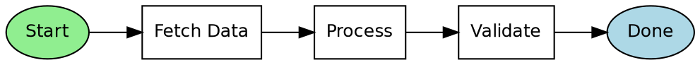
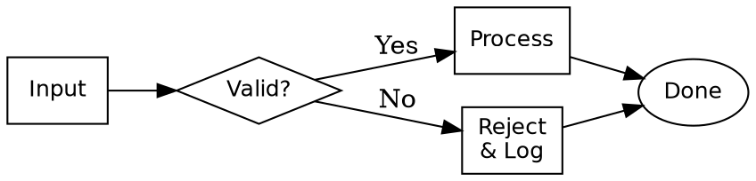
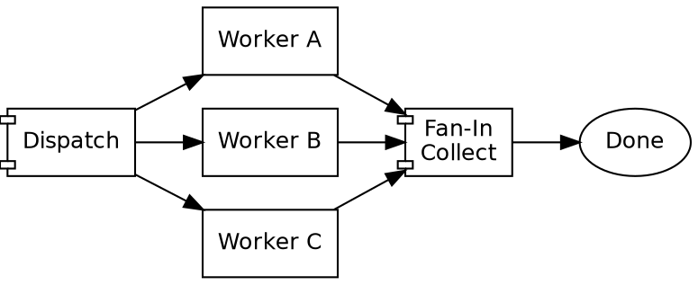
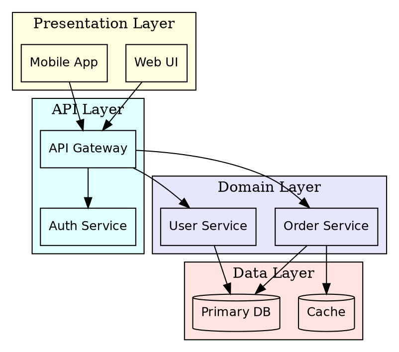
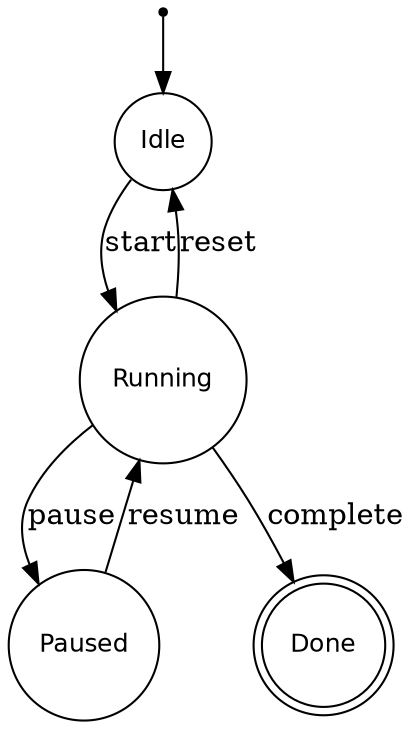
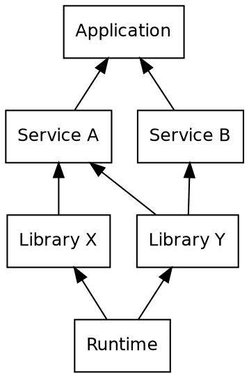
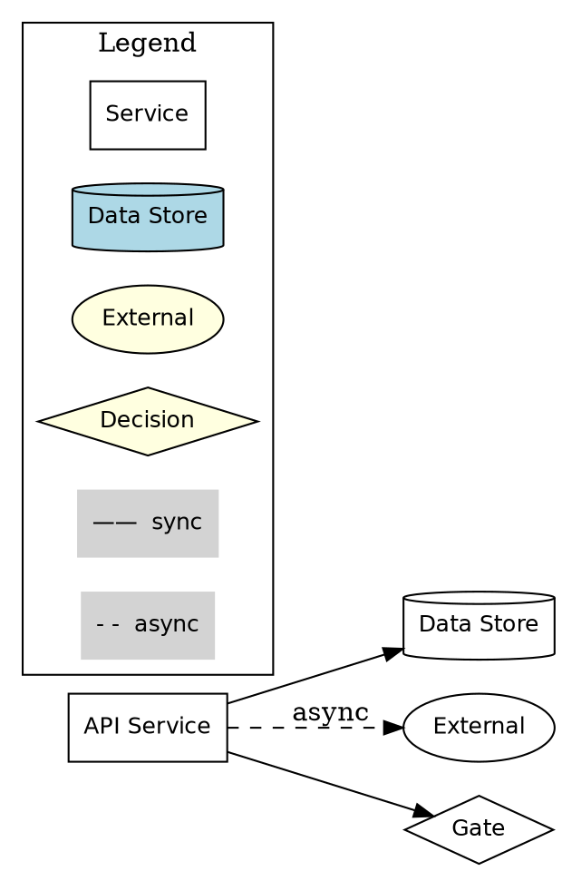
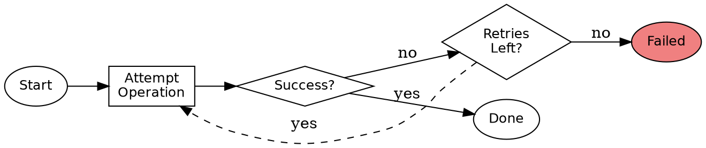
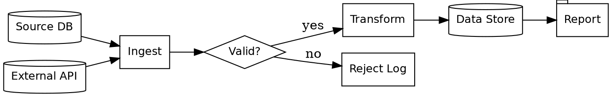
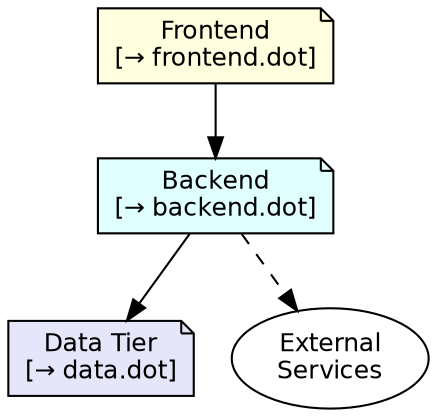

# DOT Pattern Catalog

> Copy-paste patterns for common graph structures. Each pattern includes complete,
> runnable DOT code and "Use when" guidance.
>
> Render any example: `dot -Tsvg pattern.dot -o pattern.svg`

---

## Pattern 1: Simple DAG / Workflow

**Use when:** You need a left-to-right sequential pipeline — CI/CD stages, data
processing steps, or any workflow with a clear start and end.

---

## Pattern 2: Conditional Branching

**Use when:** A decision point splits flow into two or more paths. Use a diamond
node as a pure router — it labels the question, edges label the answers.

---

## Pattern 3: Fan-Out / Fan-In Parallel

**Use when:** Work can be dispatched to independent workers concurrently, then
results collected. Use `component` shape to signal parallel dispatch and collect.

---

## Pattern 4: Layered Architecture

**Use when:** A system has clearly separated horizontal layers (presentation,
API, domain, data). Clusters visually enforce layer boundaries.

---

## Pattern 5: State Machine

**Use when:** A system has discrete states with named transitions. Use `point`
for the initial pseudo-state, `circle` for states, `doublecircle` for terminal.

---

## Pattern 6: Dependency Graph

**Use when:** Showing which components depend on which others, rendered so
lower-level foundations appear at the bottom and dependents rise above them.

---

## Pattern 7: Legend

**Use when:** A diagram uses multiple shapes or edge styles that need explanation.
Place the legend in a `cluster_legend` subgraph so it renders as a boxed key.

---

## Pattern 8: Retry Loop

**Use when:** An operation may fail and should be retried a fixed number of times
before giving up. Use a dashed back-edge (with `constraint=false`) for the retry arc.

---

## Pattern 9: Data Flow

**Use when:** Data moves through ingestion, validation, transformation, storage,
and reporting stages. Shapes communicate the role of each node at a glance.

---

## Pattern 10: Progressive Disclosure

**Use when:** A system is too large for one diagram. Create a concise `overview.dot`
using `note` shapes to summarize each subsystem, with pointers to per-subsystem
detail files (`subsystem-a.dot`, `subsystem-b.dot`, etc.).

**File naming convention:**
- `overview.dot` — system map, 150–250 lines, loads fast as agent context
- `<subsystem>.dot` — full detail for one bounded area, loaded on demand
- `.investigation/<topic>.dot` — raw investigative artifacts, load only when needed

