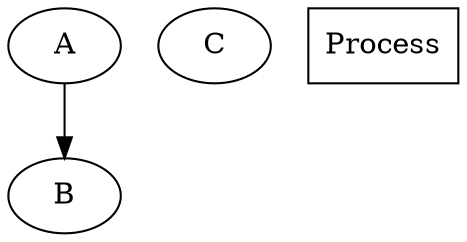
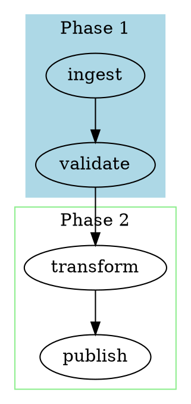
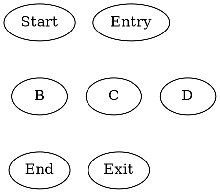
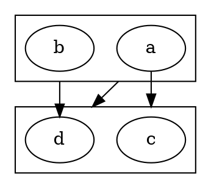
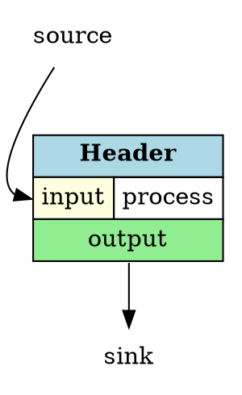

# DOT Language Syntax Reference

> Comprehensive reference for the DOT graph description language.
> Load via `@mention` inside agent sub-sessions when authoring or reviewing DOT graphs.

---

## 1. Grammar

### BNF Abstract Grammar

```
graph       : [ 'strict' ] ('graph' | 'digraph') [ ID ] '{' stmt_list '}'
stmt_list   : [ stmt [ ';' ] stmt_list ]
stmt        : node_stmt | edge_stmt | attr_stmt | ID '=' ID | subgraph
attr_stmt   : ('graph' | 'node' | 'edge') attr_list
attr_list   : '[' [ a_list ] ']' [ attr_list ]
a_list      : ID '=' ID [ (';' | ',') ] [ a_list ]
edge_stmt   : (node_id | subgraph) edgeRHS [ attr_list ]
edgeRHS     : edgeop (node_id | subgraph) [ edgeRHS ]
node_stmt   : node_id [ attr_list ]
node_id     : ID [ port ]
port        : ':' ID [ ':' compass_pt ] | ':' compass_pt
subgraph    : [ 'subgraph' [ ID ] ] '{' stmt_list '}'
compass_pt  : n | ne | e | se | s | sw | w | nw | c | _
```

### Graph Types

| Type | Edge Op | Multi-Edges | Description |
|------|---------|-------------|-------------|
| `graph` | `--` | Yes | Undirected graph |
| `digraph` | `->` | Yes | Directed graph |
| `strict graph` | `--` | No | Undirected, forbids multi-edges |
| `strict digraph` | `->` | No | Directed, forbids multi-edges |

### ID Types

| Type | Format | Example |
|------|--------|---------|
| Alphabetic | `[a-zA-Z_][a-zA-Z_0-9]*` | `my_node` |
| Numeral | `[-]?(.[0-9]+\|[0-9]+(.[0-9]*)?)` | `3.14`, `-1` |
| Double-quoted string | `"..."` with `\"` for escapes | `"hello world"` |
| HTML string | `<...>` with matched angle brackets | `<B>bold</B>` |

**Keywords (case-insensitive):** `node` · `edge` · `graph` · `digraph` · `subgraph` · `strict`

---

## 2. Nodes

### Declaration Examples



### Node Shape Reference

#### Basic Shapes

| Shape | Description | Shape | Description |
|-------|-------------|-------|-------------|
| `box` / `rectangle` | Rectangular box | `circle` | Perfect circle |
| `ellipse` | Oval (default) | `diamond` | Decision diamond |
| `point` | Small filled dot | `square` | Equal-sided box |
| `plaintext` | No border, text only | `none` | No shape drawn |

#### Extended Shapes

| Shape | Description | Shape | Description |
|-------|-------------|-------|-------------|
| `cylinder` | Database / storage | `doublecircle` | Double-bordered circle |
| `folder` | Folder tab | `box3d` | 3D box |
| `note` | Document with fold | `parallelogram` | Slanted shape |
| `tab` | Tabbed document | `trapezium` | Trapezoid |
| `component` | UML component | `hexagon` | Hexagon |
| `house` | Pentagon / house | | |

#### Special Shapes

| Shape | Notes |
|-------|-------|
| `Mdiamond` | Diamond with inset M |
| `Msquare` | Square with inset M |
| `Mcircle` | Circle with inset M |
| `record` | **Deprecated** — subdivided box; use HTML labels instead |

### Node Style Attributes

| Attribute | Description | Attribute | Description |
|-----------|-------------|-----------|-------------|
| `label` | Display text | `fontcolor` | Label text color |
| `shape` | Node shape | `width` | Min width (inches) |
| `style` | `filled`/`dashed`/`dotted`/`bold`/`rounded`/`invis`/`striped`/`wedged` | `height` | Min height (inches) |
| `color` | Border color | `fixedsize` | Force exact size |
| `fillcolor` | Fill color | `margin` | Space around label |
| `fontname` | Font family | `peripheries` | Border line count |
| `fontsize` | Font size (pt) | `penwidth` | Border thickness |
| `tooltip` | Hover text | `URL` | Hyperlink (SVG/PDF) |

---

## 3. Edges

### Declaration Examples

```dot
digraph {
  A -> B                                   // Simple directed edge
  A -> B [label="ok", color=green]         // Attributed edge
  A -> B -> C -> D                         // Chain (shorthand)
  A -> {B C D}                             // Fan-out (shorthand)
  graph { X -- Y [dir=both] }              // Bidirectional (undirected)
  node1:port_out -> node2:port_in          // Port-specific
  node1:se -> node2:nw                     // Compass point attachment
}
```

### Edge Attributes

| Attribute | Description | Attribute | Description |
|-----------|-------------|-----------|-------------|
| `label` | Edge midpoint label | `weight` | Ranking importance |
| `headlabel` | Label near arrowhead | `minlen` | Min rank separation |
| `taillabel` | Label near tail | `constraint` | Affects ranking if false |
| `color` | Edge color | `penwidth` | Line thickness |
| `style` | `solid`/`dashed`/`dotted`/`bold`/`invis` | `ltail` | Edge starts at cluster |
| `arrowhead` | Head arrow (`normal`/`vee`/`dot`/`none`/`diamond`) | `lhead` | Edge ends at cluster |
| `arrowtail` | Tail arrow style | `dir` | `forward`/`back`/`both`/`none` |

---

## 4. Graph Attributes

### Common Graph Attributes

| Attribute | Default | Description |
|-----------|---------|-------------|
| `rankdir` | `TB` | Layout direction: `TB`, `LR`, `BT`, `RL` |
| `ranksep` | `0.5` | Spacing between ranks (inches) |
| `nodesep` | `0.25` | Spacing between nodes on same rank |
| `label` | `""` | Graph title |
| `labelloc` | `b` | Label location: `t` top, `b` bottom |
| `labeljust` | `c` | Justification: `l`, `r`, `c` |
| `fontname` | `Times-Roman` | Default font |
| `fontsize` | `14` | Default font size (pt) |
| `bgcolor` | none | Background color |
| `pad` | `0.0555` | Padding around drawing (inches) |
| `size` | none | Max size `"w,h"` in inches |
| `ratio` | none | Aspect: `fill`, `compress`, `auto`, or float |
| `splines` | `true` | Edge routing: `true`/`false`/`ortho`/`polyline`/`curved`/`line` |
| `compound` | `false` | Enable edges between clusters |
| `overlap` | `true` | Node overlap: `true`/`false`/`scale`/`prism` |
| `dpi` | `96` | Output resolution |
| `newrank` | `false` | Improved rank assignment algorithm |

### Default Attribute Statements

```dot
digraph {
  node [shape=box, style=filled, fillcolor=white, fontname="Arial"]
  edge [color=gray, fontsize=10]
  graph [rankdir=LR, bgcolor=lightyellow]
}
```

---

## 5. Subgraphs and Clusters

### Cluster Subgraphs

Subgraphs named with `cluster_` prefix render as bounding rectangles:



> **Naming requirement:** The `cluster_` prefix is mandatory for cluster rendering.

### Rank Control Subgraphs



### Edges Between Clusters



---

## 6. HTML Labels

HTML labels use `<...>` delimiters and support rich table-based layout:



### Supported HTML Elements

| Element | Key Attributes |
|---------|---------------|
| `<TABLE>` | `BORDER`, `CELLBORDER`, `CELLSPACING`, `CELLPADDING`, `BGCOLOR`, `COLOR`, `STYLE` |
| `<TR>` | Table row (structural) |
| `<TD>` | `PORT`, `COLSPAN`, `ROWSPAN`, `ALIGN`, `VALIGN`, `BGCOLOR`, `BORDER`, `WIDTH`, `HEIGHT` |
| `<FONT>` | `COLOR`, `FACE`, `POINT-SIZE` |
| `<B>`, `<I>`, `<U>`, `<S>` | Bold, italic, underline, strikethrough |
| `<SUB>`, `<SUP>` | Subscript, superscript |
| `<BR/>` | Line break — `ALIGN` (`LEFT`, `RIGHT`, `CENTER`) |
| `<HR/>` | Horizontal rule separator |
| `` | Embedded image — `SRC`, `SCALE` |

---

## 7. Ports and Compass Points

### Compass Point Diagram

```
     n
   nw + ne
  w  [NODE]  e
   sw + se
     s
  c=center, _=any
```

### Port Syntax

```dot
A:n -> B:s          // Compass points (north to south)
A:se -> B:nw        // Southeast to northwest
node1:out -> node2  // Named port from HTML label PORT attribute
A:out:e -> B:n      // Named port + compass direction
```

Named ports are declared via the `PORT` attribute on HTML `<TD>` elements.

---

## 8. Layout Engines

### Engine Table

| Engine | Algorithm | Best For |
|--------|-----------|----------|
| `dot` | Sugiyama-style layered (minimizes edge crossings) | DAGs, flowcharts, hierarchy, pipelines |
| `neato` | Kamada-Kawai spring model | Small undirected graphs (<100 nodes) |
| `fdp` | Fruchterman-Reingold force-directed | Medium undirected graphs, clusters |
| `sfdp` | Multilevel force-directed (scalable) | Large graphs (1000+ nodes) |
| `twopi` | Radial — root at center | Trees, org charts with natural root |
| `circo` | Circular placement | Cyclic structures, ring topologies, FSMs |
| `osage` | Recursive cluster array packing | Cluster grids, tree maps |
| `patchwork` | Squarified treemap | Hierarchical area visualization |

### Selection Heuristic

```
DAG or hierarchy?              → dot    (best for workflow/pipeline)
Undirected, < 100 nodes?       → neato
Undirected, 100–1000 nodes?    → fdp
Very large (1000+ nodes)?      → sfdp
Radial / tree structure?       → twopi
Cyclic / ring topology?        → circo
Cluster grid layout?           → osage
Treemap (area = value)?        → patchwork
```

---

## 9. Output Formats

### Primary Formats

| Format | CLI Flag | Description | Best For |
|--------|----------|-------------|----------|
| SVG | `-Tsvg` | Scalable Vector Graphics | Web display, interactive |
| PNG | `-Tpng` | Raster image | Docs, chat embedding |
| PDF | `-Tpdf` | Portable Document Format | Print, archival |
| JSON | `-Tjson` | Structured data with layout positions | Machine processing |
| DOT | `-Tcanon` / `-Txdot` | Normalized / annotated DOT | Round-tripping |

### Rendering Commands

```bash
dot -Tsvg input.gv -o output.svg          # Render to SVG
dot -Tpng input.gv -o output.png          # Render to PNG
dot -Kneato -Tsvg input.gv -o output.svg  # Specify layout engine
dot -Tsvg input.gv > /dev/null            # Validate syntax only
dot -v -Tsvg input.gv -o output.svg       # Verbose statistics
dot -Tjson input.gv -o output.json        # Machine-readable JSON
```

---

## 10. Color Specification

| Format | Syntax | Example |
|--------|--------|---------|
| Named | X11/SVG name | `red`, `lightblue`, `forestgreen` |
| Hex RGB | `#RRGGBB` | `#FF6600` |
| Hex RGBA | `#RRGGBBAA` | `#FF660080` (50% transparent) |
| HSV | `"H,S,V"` (0.0–1.0) | `"0.6,0.5,0.9"` |

**Color lists** (for `style=striped` or `style=wedged`):

```dot
node [style=striped, fillcolor="red:blue:green"]         // Equal stripes
node [style=striped, fillcolor="red;0.3:blue;0.7"]       // Weighted stripes
node [colorscheme=blues9, fillcolor=5]                    // Brewer palette
```

---

## 11. String Features

### Newlines and Concatenation

```dot
A [label="Line 1\nLine 2"]              // \n inserts newline
B [label="Hello" + " " + "World"]      // + concatenates strings
```

### Escape Sequences

| Escape | Meaning | Escape | Meaning |
|--------|---------|--------|---------|
| `\n` | Newline (center) | `\N` | Node name |
| `\l` | Newline (left-justify) | `\G` | Graph name |
| `\r` | Newline (right-justify) | `\L` | Object label |
| `\"` | Literal quote | `\\` | Literal backslash |

### Justification

```dot
A [label="centered\nleft-aligned\lright-aligned\r"]
```

Per-line justification is controlled by the terminating escape code (`\n`, `\l`, or `\r`).

---

*Sources: [lang.html](https://graphviz.org/doc/info/lang.html) · [attrs.html](https://graphviz.org/doc/info/attrs.html) · [shapes.html](https://graphviz.org/doc/info/shapes.html)*
