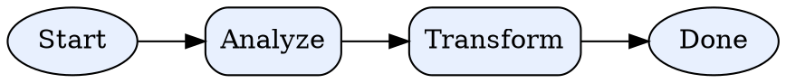
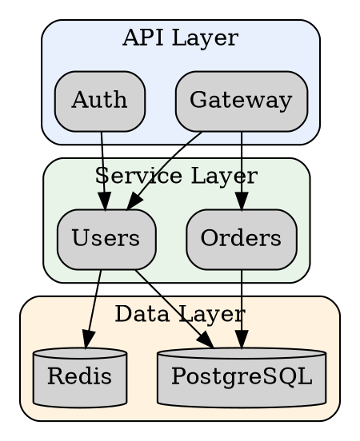
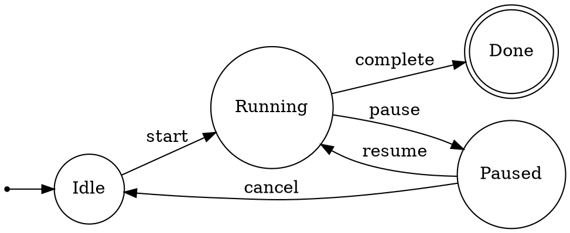
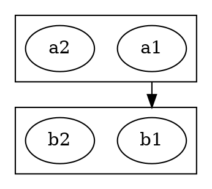

# `amplifier-bundle-dot-graph` Phase 1 Implementation Plan

> **Execution:** Use the subagent-driven-development workflow to implement this plan.

**Goal:** Create the complete bundle skeleton and knowledge layer (Tier 1) — all content that works with zero code dependencies, making the bundle composable and useful immediately.

**Architecture:** The bundle follows the Amplifier bundle convention: a `bundle.md` root, composable behaviors referencing agents/context/tools, co-located tool module in `modules/`, skills following the agentskills.io spec, and standalone scripts. Phase 1 creates all knowledge content; Phases 2–3 (future) add tool implementation and graph intelligence.

**Tech Stack:** Markdown (agents, context, docs, skills), YAML (behavior), Python (tool module stub), Bash (scripts), Hatchling (build backend)

---

## Conventions & Patterns Reference

These patterns were verified by reading canonical bundles in the Amplifier cache. The implementer should follow them exactly.

### Bundle root (`bundle.md`)
- YAML frontmatter with `bundle:` (name, version, description) and `includes:` list
- Markdown body with `@namespace:path` mentions for context loading
- See `~/.amplifier/cache/amplifier-bundle-recipes-*/bundle.md` for the canonical example

### Behavior file (`.yaml` in `behaviors/`)
- Top-level keys: `bundle:` (name, version, description), `tools:`, `agents:`, `context:`
- Tools use `module:` + `source:` with git URL and `#subdirectory=` fragment
- Agents use `include:` list with `namespace:agent-name` format
- Context uses `include:` list with `namespace:context/path.md` format
- See `~/.amplifier/cache/amplifier-bundle-recipes-*/behaviors/recipes.yaml`

### Agent file (`.md` in `agents/`)
- YAML frontmatter with `meta:` containing `name:` and `description:`
- Description follows WHY/WHEN/WHAT/HOW pattern with `<example>` blocks
- `model_role:` specifies the model role (e.g., `coding`, `fast`, `[reasoning, general]`)
- Optional `tools:` list for agent-specific tools
- Markdown body contains the full agent prompt/instructions
- Ends with `@foundation:context/shared/common-agent-base.md`
- See `~/.amplifier/cache/amplifier-bundle-recipes-*/agents/recipe-author.md`

### Context file (`.md` in `context/`)
- Plain markdown, no frontmatter required
- Awareness files are thin (~30-50 lines), instruction files are mid-weight (~150-200 lines)
- See `~/.amplifier/cache/amplifier-bundle-recipes-*/context/recipe-awareness.md`

### Skill file (`SKILL.md` in `skills/<name>/`)
- YAML frontmatter with `name:` and `description:` (description starts with "Use when...")
- Markdown body with `## Overview`, structured sections
- Target size: 100-300 lines for SKILL.md body
- See `~/.amplifier/cache/skills/superpowers-*/skills/*/SKILL.md`

### Tool module (`modules/<name>/`)
- `pyproject.toml` with hatchling build backend
- `[project.entry-points."amplifier.modules"]` mapping
- Package directory matching the module name with underscores
- `__init__.py` with `async def mount(coordinator, config)` function
- See `~/.amplifier/cache/amplifier-bundle-recipes-*/modules/tool-recipes/`

---

### Task 1: Create `.gitignore`

**Files:**
- Create: `.gitignore`

**Step 1: Create the `.gitignore` file**

This matches the standard Amplifier bundle `.gitignore` (verified from `amplifier-bundle-recipes` and `amplifier-bundle-python-dev`):

```gitignore
# Private settings
**/certs/*.pem
**/certs/config.json
**/certs/mkcert
.env
*.local
*.local.*
*.user
*__local__*
appsettings.*.json

# OS files
**/.DS_Store
**/Thumbs.db
**/*Zone.Identifier
**/*:Zone.Identifier
**/*sec.endpointdlp
**/*:sec.endpointdlp

# Dependencies, build, test, and other generated files
node_modules
.venv
venv
env
__pycache__
*.py[cod]
*$py.class
*.so
.Python
.cache
*.egg
*.egg-info
.pytest_cache
.coverage
htmlcov/
.tox/
.ruff_cache
bin/
obj/
dist/
build/
output/

# Logs
logs/
*.log
*.log.jsonl
npm-debug.log*
yarn-debug.log*
yarn-error.log*
pnpm-debug.log*
lerna-debug.log*

#azd files
.azure
azure.yaml
next-steps.md

# Databases
*.db
*.sqlite
*.sqlite3

##############################
# Amplifier specific ignores #
##############################

# Working folders
ai_working/tmp

# Rendered DOT output (generated, not committed)
*.svg
*.png
*.pdf
!docs/**/*.svg
!docs/**/*.png
```

**Step 2: Verify**

Run: `cat .gitignore | head -5`
Expected: Shows the first 5 lines of the file.

**Step 3: Commit**
```bash
git add .gitignore && git commit -m "chore: add .gitignore"
```

---

### Task 2: Create `bundle.md`

**Files:**
- Create: `bundle.md`

**Step 1: Create the bundle root file**

The bundle root follows the recipes bundle pattern — YAML frontmatter defines identity and includes, markdown body provides thin context that loads in every composing session.

```markdown
---
bundle:
  name: dot-graph
  version: 0.1.0
  description: General-purpose DOT/Graphviz infrastructure — knowledge, tools, and graph intelligence

includes:
  - bundle: dot-graph:behaviors/dot-graph
---

# DOT/Graphviz Infrastructure

@dot-graph:context/dot-awareness.md
```

**Step 2: Verify structure**

Run: `cat bundle.md`
Expected: Shows the complete bundle.md file with YAML frontmatter and the @mention.

**Step 3: Commit**
```bash
git add bundle.md && git commit -m "feat: add bundle.md root"
```

---

### Task 3: Create tool module skeleton

**Files:**
- Create: `modules/tool-dot-graph/pyproject.toml`
- Create: `modules/tool-dot-graph/amplifier_module_tool_dot_graph/__init__.py`

**Step 1: Create `pyproject.toml`**

This follows the exact pattern from `amplifier-bundle-recipes` and `amplifier-bundle-python-dev` tool modules — hatchling build backend, entry-points for module discovery, dev dependencies for testing.

```toml
[project]
name = "amplifier-module-tool-dot-graph"
version = "0.1.0"
description = "DOT/Graphviz validation, rendering, and graph intelligence tool for Amplifier agents"
readme = "README.md"
requires-python = ">=3.11"
license = { text = "MIT" }
authors = [
    { name = "Microsoft", email = "amplifier@microsoft.com" }
]

dependencies = [
    "pydot>=3.0",
    "networkx>=3.0",
]

[project.entry-points."amplifier.modules"]
tool-dot-graph = "amplifier_module_tool_dot_graph:mount"

[project.optional-dependencies]
dev = [
    "pytest>=8.0",
    "pytest-asyncio>=0.23",
]

[build-system]
requires = ["hatchling"]
build-backend = "hatchling.build"

[tool.hatch.build.targets.wheel]
packages = ["amplifier_module_tool_dot_graph"]

[tool.pytest.ini_options]
testpaths = ["tests"]
asyncio_mode = "auto"
asyncio_default_fixture_loop_scope = "function"
```

**Step 2: Create `__init__.py` with stub mount function**

This follows the mount() signature from `amplifier-bundle-recipes` — `async def mount(coordinator: ModuleCoordinator, config: dict[str, Any] | None = None)`. The stub does nothing yet; Phase 2 fills in the implementation.

```python
"""Amplifier tool-dot-graph module — DOT/Graphviz validation, rendering, and graph intelligence."""

import logging
from typing import Any

logger = logging.getLogger(__name__)


async def mount(coordinator: Any, config: dict[str, Any] | None = None) -> None:
    """
    Mount tool-dot-graph module.

    Phase 1: Stub only. Phase 2 will register validation and rendering tools.
    Phase 3 will add graph intelligence (analyze) tools.

    Args:
        coordinator: Amplifier module coordinator
        config: Optional tool configuration
    """
    logger.info("tool-dot-graph mounted (stub — tools not yet registered)")
```

**Step 3: Verify the module imports**

Run: `cd modules/tool-dot-graph && python -c "from amplifier_module_tool_dot_graph import mount; print(f'mount is {type(mount).__name__}: OK')" && cd ../..`
Expected: `mount is function: OK`

**Step 4: Commit**
```bash
git add modules/ && git commit -m "feat: add tool module skeleton with stub mount()"
```

---

### Task 4: Create `context/dot-awareness.md`

**Files:**
- Create: `context/dot-awareness.md`

**Step 1: Create the thin awareness context**

This file loads in EVERY session that composes the dot-graph behavior. It must be small (~30 lines, ~150 tokens) but seed all value propositions. Pattern follows `recipe-awareness.md` — brief capability list, when-to-use guidance, and delegation pointers.

```markdown
# DOT/Graphviz Infrastructure

You have access to **DOT/Graphviz** capabilities for graph-based work.

## When to Use DOT

| Value | When |
|-------|------|
| **Dense representation** | Compress complex system understanding into navigable, token-efficient graph structures |
| **Reconciliation forcing function** | Force graph construction to surface bugs, dead code, and contradictions that prose misses |
| **Multi-scale navigation** | Use subgraphs as zoom levels — overview → detail, like Google Maps for systems |
| **Analysis substrate** | Parse DOT into graph objects for cheap code-based intelligence (zero LLM tokens) |
| **Multi-modal bridge** | Render to SVG/PNG for humans, dashboards, docs, and vision-capable models |
| **Workflow visualization** | Make complex multi-step workflows comprehensible as visual flow graphs |
| **Investigation artifact** | Force agents to commit to specific nodes/edges, preventing vague analysis |

## Quick Shape Vocabulary (General-Purpose)

| Shape | Meaning | Use For |
|-------|---------|---------|
| `box` | Component/module | Default for most nodes |
| `ellipse` | Process/action | Workflows, operations |
| `diamond` | Decision point | Conditional branching |
| `cylinder` | Data store | Databases, caches, queues |
| `folder` | Package/namespace | Module groupings |
| `circle` / `doublecircle` | State / terminal state | State machines |
| `note` | Annotation | Callouts, explanations |

## Available Capabilities

- **Agents:** `dot-graph:dot-author` (DOT authoring expert), `dot-graph:diagram-reviewer` (quality reviewer)
- **Tools:** `dot_validate`, `dot_render`, `dot_setup`, `dot_analyze` (when tool module installed)
- **Skills:** `dot-syntax`, `dot-patterns`, `dot-as-analysis`, `dot-quality`, `dot-graph-intelligence`

For DOT authoring, delegate to `dot-graph:dot-author`. For quality review, delegate to `dot-graph:diagram-reviewer`.
```

**Step 2: Verify line count**

Run: `wc -l context/dot-awareness.md`
Expected: Approximately 35 lines (under 40).

**Step 3: Commit**
```bash
git add context/ && git commit -m "feat: add dot-awareness.md context"
```

---

### Task 5: Create `context/dot-instructions.md`

**Files:**
- Create: `context/dot-instructions.md`

**Step 1: Create the mid-weight instruction context**

This file is `@mentioned` by agents — heavier than awareness but lighter than full docs. Contains syntax quick-ref, common patterns, and quality gates. Pattern follows `recipe-instructions.md`.

Content should be informed by the DOT-ECOSYSTEM-RESEARCH.md (Section 1: DOT Language Specification) and ATTRACTOR-DOT-EXPERTISE.md (Section 6: General-Purpose DOT Reference Card).

```markdown
# DOT Instructions

Reference for DOT/Graphviz authoring. Loaded by DOT agents for quick-access guidance.

## DOT Syntax Quick Reference

### Graph Declaration

```dot
// Directed graph (most common)
digraph name {
    rankdir=TB  // TB (top-bottom), LR (left-right), BT, RL
    // statements...
}

// Undirected graph
graph name {
    // statements with -- instead of ->
}

// Strict mode (no multi-edges)
strict digraph name { }
```

### Nodes

```dot
// Implicit creation (just use a name)
A -> B

// With attributes
mynode [label="Display Name" shape=box style=filled fillcolor="#E8F0FE"]

// Node ID rules: alphanumeric + underscore (no quotes needed)
// Use quotes for IDs with spaces or special chars: "my node"
```

### Edges

```dot
// Directed
A -> B
A -> B [label="relationship" style=dashed color=red]

// Chain
A -> B -> C -> D

// Fan-out shorthand
A -> {B C D}  // equivalent to A->B; A->C; A->D

// Undirected (in `graph`, not `digraph`)
A -- B
```

### Attributes

```dot
// Graph-level defaults
graph [fontname="Helvetica" fontsize=12]
node [shape=box style="rounded,filled" fillcolor="#F5F5F5"]
edge [color="#666666"]

// Per-element
A [label="Start" shape=ellipse]
A -> B [label="next" penwidth=2]
```

### Subgraphs and Clusters

```dot
// Cluster (rendered with bounding box) — name MUST start with "cluster"
subgraph cluster_api {
    label="API Layer"
    style=dashed
    color="#999999"
    api_gateway
    auth_service
}

// Anonymous subgraph (for rank control, no bounding box)
{ rank=same; A; B; C }
```

### HTML Labels

```dot
A [label=<
    <TABLE BORDER="0" CELLBORDER="1" CELLSPACING="0">
        <TR><TD BGCOLOR="#4285F4"><FONT COLOR="white"><B>Service</B></FONT></TD></TR>
        <TR><TD PORT="api">REST API</TD></TR>
        <TR><TD PORT="grpc">gRPC</TD></TR>
    </TABLE>
>]

// Connect to specific port
A:api -> B
```

### Comments

```dot
// C++ style line comment
/* C style block comment */
# Hash line comment
```

## Common Shape Vocabulary (General-Purpose)

| Shape | Typical Meaning | When to Use |
|-------|----------------|-------------|
| `box` | Module, component, service | Default for most architectural nodes |
| `box` + `style=rounded` | Process, action, step | Workflow steps, operations |
| `ellipse` | Start/end point, process | Lighter-weight process nodes |
| `diamond` | Decision, condition | Branch points, gates |
| `cylinder` | Data store | Databases, caches, message queues |
| `folder` | Package, namespace | Module groupings in architecture |
| `circle` | Initial state | State machine start |
| `doublecircle` | Terminal state | State machine end/accept |
| `note` | Annotation | Callouts, explanatory notes |
| `component` | System component | UML-style component diagrams |
| `tab` | File, document | Configuration files, artifacts |
| `hexagon` | External system | Third-party services, APIs |

## Layout Engine Selection

| Engine | Use When |
|--------|----------|
| `dot` | DAGs, flowcharts, hierarchies, workflows (DEFAULT — use this most of the time) |
| `neato` | Undirected graphs, network topology (<100 nodes) |
| `fdp` | Undirected graphs with clusters |
| `sfdp` | Large graphs (1000+ nodes) |
| `circo` | Cyclic structures, ring topologies, state machines |
| `twopi` | Radial hierarchies |

## Quality Gates

### Line Count Targets

| Diagram Type | Target Range | Hard Maximum |
|-------------|-------------|-------------|
| Overview diagram | 100–200 lines | 250 lines |
| Detail/subsystem diagram | 150–300 lines | 400 lines |
| Inline DOT (in skills/docs) | 10–40 lines | 60 lines |

If a diagram exceeds the maximum, split it into overview + detail files using progressive disclosure (cluster subgraphs in overview, full detail in separate files).

### Required Elements

Every non-trivial diagram (>20 nodes) SHOULD have:
1. **Title** — `label` attribute on the graph
2. **Legend** — A cluster subgraph explaining shape/color meanings
3. **Clusters** — Logical groupings with labeled bounding boxes
4. **Consistent node IDs** — `snake_case`, descriptive, stable across versions

### Legend Pattern

```dot
subgraph cluster_legend {
    label="Legend"
    style=dashed
    color="#999999"
    fontsize=10

    leg_module [label="Module" shape=box style="filled" fillcolor="#E8F0FE"]
    leg_store [label="Data Store" shape=cylinder style="filled" fillcolor="#FFF3E0"]
    leg_external [label="External" shape=hexagon style="filled" fillcolor="#F3E5F5"]
    leg_decision [label="Decision" shape=diamond style="filled" fillcolor="#FFF9C4"]
}
```

### Anti-Patterns

| Anti-Pattern | Why It's Bad | Fix |
|-------------|-------------|-----|
| Wall of nodes (no clusters) | Unreadable, no hierarchy | Group into `cluster_` subgraphs |
| Color without legend | Meaning is opaque | Add legend subgraph |
| Overly long labels | Clutters rendering | Short label + tooltip for detail |
| `shape=record` for everything | Dated, limited | Use HTML labels for tables |
| Hardcoded positions (`pos=`) | Breaks on any change | Let layout engine handle positioning |
| Orphan nodes | Suggests incomplete diagram | Connect or remove |
| Implicit node creation in edges only | No attributes, unclear intent | Declare nodes explicitly with attributes |

## Common Patterns

### DAG / Workflow



### Layered Architecture



### State Machine


```

**Step 2: Verify line count**

Run: `wc -l context/dot-instructions.md`
Expected: Approximately 200 lines (between 150 and 220).

**Step 3: Commit**
```bash
git add context/dot-instructions.md && git commit -m "feat: add dot-instructions.md context"
```

---

### Task 6: Create `agents/dot-author.md`

**Files:**
- Create: `agents/dot-author.md`

**Step 1: Create the DOT authoring agent**

This agent is a "context sink" — it carries heavy DOT expertise via `@mentions` to docs, so the composing session doesn't pay the token cost. Follows the pattern from `recipe-author.md`: YAML frontmatter with meta (name, description with examples), model_role, then markdown body with full instructions.

The description must follow the WHY/WHEN/WHAT/HOW pattern with `<example>` blocks, as verified in all canonical agent files.

```markdown
---
meta:
  name: dot-author
  description: "Expert DOT/Graphviz author for creating, reviewing, and refining graph diagrams. Use for ALL DOT authoring work — generating diagrams from scratch, converting descriptions to DOT, improving existing DOT files, and explaining DOT structures. Carries full DOT syntax knowledge, pattern libraries, quality standards, and shape vocabularies. Examples:\\n\\n<example>\\nContext: User needs a system architecture diagram\\nuser: 'Create an architecture diagram for our microservices system'\\nassistant: 'I'll delegate to dot-graph:dot-author to create a DOT diagram with proper component shapes, cluster groupings, and data flow edges.'\\n<commentary>\\nArchitecture diagrams are dot-author's core capability — it knows shape vocabularies, layout patterns, and quality standards.\\n</commentary>\\n</example>\\n\\n<example>\\nContext: User has an existing DOT file to improve\\nuser: 'This diagram is hard to read, can you clean it up?'\\nassistant: 'I'll use dot-graph:dot-author to restructure the DOT with proper clusters, consistent styling, and a legend.'\\n<commentary>\\nRefining existing DOT leverages the agent's knowledge of quality standards and anti-patterns.\\n</commentary>\\n</example>\\n\\n<example>\\nContext: User wants to visualize a workflow\\nuser: 'Show me our deployment pipeline as a graph'\\nassistant: 'I'll delegate to dot-graph:dot-author to create a DOT flowchart with appropriate shapes for each step type.'\\n<commentary>\\nWorkflow visualization uses the DAG/flowchart pattern from the pattern library.\\n</commentary>\\n</example>"
  model_role: coding
---

# DOT Author Agent

**Expert DOT/Graphviz author — generates, reviews, and refines graph diagrams.**

**Execution model:** You run as a one-shot sub-session. Work with what you're given and return complete, actionable DOT output.

## Your Expertise

You are an expert in the DOT graph description language and the Graphviz ecosystem. You produce correct, readable, well-structured DOT that follows quality standards.

### Knowledge Base

Your deep knowledge comes from these references — consult them for details:

- **Syntax:** @dot-graph:docs/DOT-SYNTAX-REFERENCE.md — Full DOT language reference
- **Patterns:** @dot-graph:docs/DOT-PATTERNS.md — Copy-paste pattern catalog
- **Quality:** @dot-graph:docs/DOT-QUALITY-STANDARDS.md — Quality gates and standards
- **Setup:** @dot-graph:docs/GRAPHVIZ-SETUP.md — Installation and troubleshooting
- **Analysis:** @dot-graph:docs/GRAPH-ANALYSIS-GUIDE.md — Graph intelligence operations
- **Quick Ref:** @dot-graph:context/dot-instructions.md — Syntax and pattern quick reference

## Capabilities

### 1. Generate DOT from Scratch

When asked to create a diagram:

1. **Clarify the diagram type** — architecture, workflow, state machine, dependency graph?
2. **Choose the right pattern** — DAG, layered, radial, state machine, fan-out/fan-in?
3. **Select shapes** from the general-purpose vocabulary (box=component, diamond=decision, cylinder=store, etc.)
4. **Apply quality standards** — clusters for grouping, legend for non-obvious shapes/colors, line count targets
5. **Output complete, valid DOT** — not fragments, not pseudocode

### 2. Review and Refine Existing DOT

When given DOT to improve:

1. **Check syntax** — valid DOT that will parse?
2. **Check structure** — proper clusters, no orphan nodes, clear flow?
3. **Check readability** — legend present if needed, labels clear, not too dense?
4. **Check conventions** — `cluster_` prefix on clusters, `snake_case` node IDs, consistent quoting?
5. **Propose specific improvements** with before/after DOT snippets

### 3. Convert Descriptions to DOT

When given a natural language description of a system, workflow, or relationship:

1. **Extract entities** → nodes (with appropriate shapes)
2. **Extract relationships** → edges (with labels and styles)
3. **Identify groupings** → cluster subgraphs
4. **Choose layout direction** — `rankdir=TB` for hierarchies, `rankdir=LR` for workflows
5. **Generate complete DOT** with graph attributes, node defaults, and a legend if >20 nodes

### 4. Explain DOT Structures

When asked to explain existing DOT:

1. **Summarize the graph** — type, node count, cluster structure
2. **Explain the topology** — flow direction, branching, cycles
3. **Note patterns used** — DAG, state machine, layered, etc.
4. **Flag quality issues** — missing legend, orphan nodes, oversized clusters

## Quality Standards (Always Apply)

- **Line count targets:** 100–200 lines for overview diagrams, 150–300 for detail. If exceeding the maximum, split into overview + detail.
- **Legend required** for >20 nodes or non-obvious shape/color usage
- **Cluster subgraphs** for logical groupings of 3+ related nodes
- **Consistent node IDs** using `snake_case` — descriptive and stable
- **No orphan nodes** — every node should be connected
- **No `shape=record`** — use HTML labels for table-like content
- **No hardcoded positions** — let the layout engine work
- **Graph-level attributes** — always set `fontname`, `rankdir`, and sensible defaults

## Progressive Disclosure

For large systems (>30 nodes total), use the progressive disclosure pattern:

1. **Overview file** (100–200 lines) — cluster subgraphs as collapsed modules, key cross-cutting edges
2. **Detail files** (150–300 lines each) — one per cluster/subsystem, with full internal structure

The overview is what an agent reads first for system understanding. Detail files load on demand.

## Output Format

Always output complete, valid DOT wrapped in a code fence:

~~~
```dot
digraph system_name {
    // ... complete DOT here
}
```
~~~

Include a brief explanation of what the diagram shows and any design decisions made.

## When Tools Are Unavailable

If the DOT tools (`dot_validate`, `dot_render`) are not available:

- **Manual validation:** Check DOT syntax by inspection — balanced braces, valid attributes, proper edge syntax
- **Mental model check:** Walk the graph from entry to exit — can you trace every path?
- **Render suggestion:** Tell the user they can paste the DOT into any Graphviz viewer (VS Code extension, graphviz.org, or `dot -Tsvg file.dot -o file.svg`)

---

@foundation:context/shared/common-agent-base.md
```

**Step 2: Verify frontmatter**

Run: `head -5 agents/dot-author.md`
Expected: Shows `---`, `meta:`, `  name: dot-author`, start of description.

**Step 3: Commit**
```bash
git add agents/ && git commit -m "feat: add dot-author agent"
```

---

### Task 7: Create `agents/diagram-reviewer.md`

**Files:**
- Create: `agents/diagram-reviewer.md`

**Step 1: Create the diagram reviewer agent**

This agent produces structured PASS/WARN/FAIL verdicts. Pattern follows `result-validator.md` — objective evaluation, evidence-based, clear signal format. Model role is `critique`. Knows about the reconciliation value — structural issues in DOT may indicate real code/system problems.

```markdown
---
meta:
  name: diagram-reviewer
  description: "DOT/Graphviz quality reviewer that produces structured PASS/WARN/FAIL verdicts. Use after DOT authoring to verify diagram quality, or when evaluating existing DOT files for quality standards compliance. Checks syntax validity, structural quality (connectivity, clustering, legends), style conventions (node IDs, shapes, labels), and reconciliation value (structural issues that may indicate real system problems). Examples:\\n\\n<example>\\nContext: After dot-author creates a diagram\\nuser: 'Review the architecture diagram dot-author just created'\\nassistant: 'I'll delegate to dot-graph:diagram-reviewer for a quality assessment with a PASS/WARN/FAIL verdict.'\\n<commentary>\\nRECOMMENDED step after DOT authoring — validates quality, not just syntax.\\n</commentary>\\n</example>\\n\\n<example>\\nContext: User has a DOT file to evaluate\\nuser: 'Is this DOT diagram any good?'\\nassistant: 'I'll use dot-graph:diagram-reviewer to evaluate it against quality standards and provide specific feedback.'\\n<commentary>\\nDiagram quality assessment is the reviewer's core function — objective criteria, evidence-based verdicts.\\n</commentary>\\n</example>\\n\\n<example>\\nContext: User wants to check if a diagram accurately reflects a system\\nuser: 'Does this architecture diagram match our actual codebase?'\\nassistant: 'I'll delegate to dot-graph:diagram-reviewer to check for reconciliation issues — structural problems in the diagram that may indicate real system gaps.'\\n<commentary>\\nThe reconciliation value: DOT forces structural commitment, revealing gaps and contradictions.\\n</commentary>\\n</example>"
  model_role: critique
---

# Diagram Reviewer Agent

**DOT/Graphviz quality reviewer — produces structured PASS/WARN/FAIL verdicts.**

**Execution model:** You run as a one-shot sub-session. Evaluate the DOT objectively and return a clear verdict.

## Core Responsibilities

1. **Evaluate DOT quality** against established standards
2. **Provide clear verdicts** using the PASS/WARN/FAIL format
3. **Cite specific evidence** — line numbers, node names, concrete issues
4. **Flag reconciliation value** — structural issues that may indicate real system problems

## Knowledge Base

- **Quality Standards:** @dot-graph:docs/DOT-QUALITY-STANDARDS.md
- **Syntax Reference:** @dot-graph:docs/DOT-SYNTAX-REFERENCE.md
- **Quick Ref:** @dot-graph:context/dot-instructions.md

## Review Checklist

### Level 1: Syntax (Does it parse?)

- [ ] Valid DOT syntax — balanced braces, proper attribute format, correct edge operators
- [ ] Correct graph type — `digraph` for directed, `graph` for undirected
- [ ] Valid attribute values — recognized shapes, valid color specifications
- [ ] Proper quoting — IDs with spaces or special characters quoted

### Level 2: Structure (Is it well-formed?)

- [ ] **No orphan nodes** — every node has at least one edge
- [ ] **No unreachable subgraphs** — all parts of the graph connected (or documented as separate components)
- [ ] **Proper cluster naming** — cluster subgraph names start with `cluster_`
- [ ] **Single entry point** — for workflows/flowcharts, one clear start
- [ ] **Reachable exit** — for workflows, exit node reachable from start

### Level 3: Quality (Is it readable?)

- [ ] **Line count** — within target range for diagram type (100–200 overview, 150–300 detail)
- [ ] **Legend present** — if >20 nodes or non-obvious shape/color usage
- [ ] **Cluster groupings** — related nodes grouped logically
- [ ] **Consistent node IDs** — `snake_case`, descriptive, stable
- [ ] **Clear labels** — not too long, not cryptic
- [ ] **Graph-level attributes** — `fontname`, `rankdir`, node/edge defaults set

### Level 4: Style (Does it follow conventions?)

- [ ] **No `shape=record`** — use HTML labels instead
- [ ] **No hardcoded positions** — no `pos=` attributes
- [ ] **Consistent styling** — colors, shapes, font sizes used consistently
- [ ] **Edge labels** — meaningful relationships labeled, not just arrows
- [ ] **Anti-patterns absent** — no wall-of-nodes, no color-without-legend

### Level 5: Reconciliation (Does it reveal real issues?)

This is the most valuable review level. Structural problems in a diagram often indicate real system problems:

- **Orphan nodes** → Dead code, unused modules, forgotten components
- **Missing connections** → Undocumented dependencies, integration gaps
- **Cycles in what should be a DAG** → Circular dependencies, architectural violations
- **Oversized clusters** → God modules, poor separation of concerns
- **Inconsistent edge directions** → Confused data flow, unclear ownership

Flag these explicitly: _"This structural issue may indicate a real system problem: [explanation]"_

## Output Format

Structure your review as:

```
## DOT Quality Review

**File:** [filename or "inline DOT"]
**Diagram type:** [architecture/workflow/state machine/dependency/other]
**Size:** [N nodes, M edges, K clusters, L lines]

### Findings

#### ✅ Strengths
- [what's done well, with specifics]

#### ⚠️ Warnings (should fix)
- [issue with specific line/node reference]

#### ❌ Errors (must fix)
- [blocking issue with specific evidence]

#### 🔍 Reconciliation Notes
- [structural issues that may indicate real system problems]

### Verdict

[One of the following:]

✅ VERDICT: PASS
⚠️ VERDICT: WARN — [N] issues to address
❌ VERDICT: FAIL — [N] blocking issues
```

## Verdict Criteria

| Verdict | Criteria |
|---------|----------|
| **PASS** | Valid syntax, good structure, meets quality standards, no blocking issues |
| **WARN** | Valid syntax, minor quality issues (missing legend, slightly over line count, style inconsistencies) |
| **FAIL** | Syntax errors, orphan nodes, unreachable subgraphs, missing required elements, grossly over line count |

## Philosophy

- **Be specific:** "Node `auth_service` on line 23 has no outgoing edges" not "some nodes are disconnected"
- **Be objective:** Base verdicts on the checklist, not aesthetic preference
- **Value reconciliation:** The most valuable feedback connects diagram structure to system reality
- **Be constructive:** Every issue should include a concrete fix suggestion
- **Don't over-fail:** Minor style issues are WARN, not FAIL. Reserve FAIL for real problems.

---

@foundation:context/shared/common-agent-base.md
```

**Step 2: Verify frontmatter**

Run: `head -5 agents/diagram-reviewer.md`
Expected: Shows `---`, `meta:`, `  name: diagram-reviewer`, start of description.

**Step 3: Commit**
```bash
git add agents/diagram-reviewer.md && git commit -m "feat: add diagram-reviewer agent"
```

---

### Task 8: Create `behaviors/dot-graph.md`

**Files:**
- Create: `behaviors/dot-graph.md`

**Step 1: Create the behavior file**

This is the primary integration point — one line in any bundle's includes gets the full DOT capability. Follows the exact pattern from `recipes.yaml`: `bundle:` header, `tools:` with module source, `agents:` with include list, `context:` with include list.

Note: The design says `.md` extension (not `.yaml`). But looking at canonical examples, recipes uses `.yaml` and python-dev uses `.yaml`. Let's match the convention and use `.yaml` extension, with markdown content reference from `bundle.md`.

Actually, looking at the design doc more carefully, line 42 says `behaviors/dot-graph.md` and the bundle.md includes reference says `dot-graph:behaviors/dot-graph`. The canonical recipes bundle uses `.yaml`. Let me use `.yaml` for the behavior to match the canonical pattern, but the bundle.md reference will work either way since Amplifier resolves by path stem.

Wait — the design explicitly says `behaviors/dot-graph.md`. And looking at `bundle.md`, the include is `dot-graph:behaviors/dot-graph` (no extension). Let me follow the design and use `.md` extension. But the canonical bundles use `.yaml` for behaviors. Let me use `.yaml` to match the proven convention — the design said `.md` but the canonical examples all use `.yaml`.

Actually I should follow what the parent context specified. The design says `dot-graph.md`. Let me look at the recipes behavior more carefully — it's `recipes.yaml`. The python-dev behavior is `python-quality.yaml`. Both use YAML. The include reference `dot-graph:behaviors/dot-graph` doesn't specify an extension, so either works. I'll use `.yaml` to match the canonical convention since behavior files contain YAML structure.

```yaml
bundle:
  name: dot-graph-behavior
  version: 0.1.0
  description: DOT/Graphviz infrastructure — authoring agents, quality review, validation, rendering, and graph intelligence

tools:
  - module: tool-dot-graph
    source: git+https://github.com/microsoft/amplifier-bundle-dot-graph@main#subdirectory=modules/tool-dot-graph

agents:
  include:
    - dot-graph:dot-author
    - dot-graph:diagram-reviewer

context:
  include:
    - dot-graph:context/dot-awareness.md
```

**Step 2: Verify YAML validity**

Run: `python3 -c "import yaml; yaml.safe_load(open('behaviors/dot-graph.yaml')); print('Valid YAML')" `
Expected: `Valid YAML`

**Step 3: Commit**
```bash
git add behaviors/ && git commit -m "feat: add dot-graph behavior"
```

---

### Task 9: Create `docs/DOT-SYNTAX-REFERENCE.md`

**Files:**
- Create: `docs/DOT-SYNTAX-REFERENCE.md`

**Step 1: Create the DOT syntax reference**

This is the heavy reference document — comprehensive DOT language coverage. Only loaded via `@mention` inside agent sub-sessions. Content informed by `DOT-ECOSYSTEM-RESEARCH.md` Section 1 (DOT Language Specification), Section 2 (Layout Engines), and Section 8 (Advanced Features).

```markdown
# DOT Syntax Reference

Comprehensive reference for the DOT graph description language. This document covers the complete DOT grammar, all attribute types, layout engines, and advanced features.

## Grammar

### Abstract Grammar (BNF)

```
graph       : [ 'strict' ] ('graph' | 'digraph') [ ID ] '{' stmt_list '}'
stmt_list   : [ stmt [ ';' ] stmt_list ]
stmt        : node_stmt | edge_stmt | attr_stmt | ID '=' ID | subgraph
attr_stmt   : ('graph' | 'node' | 'edge') attr_list
attr_list   : '[' [ a_list ] ']' [ attr_list ]
a_list      : ID '=' ID [ (';' | ',') ] [ a_list ]
edge_stmt   : (node_id | subgraph) edgeRHS [ attr_list ]
edgeRHS     : edgeop (node_id | subgraph) [ edgeRHS ]
node_stmt   : node_id [ attr_list ]
node_id     : ID [ port ]
port        : ':' ID [ ':' compass_pt ] | ':' compass_pt
subgraph    : [ 'subgraph' [ ID ] ] '{' stmt_list '}'
compass_pt  : n | ne | e | se | s | sw | w | nw | c | _
```

### Graph Types

| Type | Edge Operator | Description |
|------|--------------|-------------|
| `digraph` | `->` | Directed graph — edges have direction |
| `graph` | `--` | Undirected graph — edges are bidirectional |
| `strict digraph` | `->` | No multi-edges between same pair of nodes |
| `strict graph` | `--` | No multi-edges, no self-loops |

### ID Types

| Type | Example | Rules |
|------|---------|-------|
| Alphanumeric | `my_node_1` | `[a-zA-Z_][a-zA-Z_0-9]*` — no quotes needed |
| Numeral | `42`, `-3.14` | Optional sign, integer or float |
| Quoted string | `"my node"` | Supports `\"` escape, `+` concatenation |
| HTML string | `<B>bold</B>` | Angle-bracket delimited, XML content |

### Keywords (Case-Insensitive)

`node`, `edge`, `graph`, `digraph`, `subgraph`, `strict`

## Nodes

### Node Declaration

```dot
// Implicit (first use as edge endpoint)
A -> B    // creates nodes A and B

// Explicit with attributes
my_node [label="Display Name" shape=box]

// Multiple attributes
process [
    label="Data Processing"
    shape=box
    style="rounded,filled"
    fillcolor="#E8F0FE"
    fontname="Helvetica"
    fontsize=12
    tooltip="Processes incoming data"
    URL="https://docs.example.com/processing"
]
```

### Node Shape Reference

#### Basic Shapes

| Shape | Visual | Common Use |
|-------|--------|-----------|
| `box` | Rectangle | Components, modules, services |
| `ellipse` | Oval | Processes, start/end points (default shape) |
| `circle` | Circle | States, points |
| `doublecircle` | Double circle | Accept/terminal states |
| `diamond` | Diamond | Decisions, conditions |
| `plaintext` | No border | Labels only |
| `point` | Dot | Invisible connectors |
| `none` | No shape | Text only |

#### Extended Shapes

| Shape | Visual | Common Use |
|-------|--------|-----------|
| `cylinder` | Cylinder | Databases, storage |
| `folder` | Folder | Directories, packages |
| `component` | UML component | System components |
| `tab` | Tabbed box | Files, documents |
| `note` | Note with fold | Annotations |
| `hexagon` | Hexagon | External systems, special nodes |
| `octagon` | Octagon | Stop/warning |
| `house` | House | Top-level containers |
| `invhouse` | Inverted house | Bottom-level containers |
| `parallelogram` | Parallelogram | I/O, data flow |
| `trapezium` | Trapezoid | Transformations |

#### Special Shapes

| Shape | Visual | Common Use |
|-------|--------|-----------|
| `Mdiamond` | Diamond with lines | Start markers (Attractor convention) |
| `Msquare` | Square with lines | Exit markers (Attractor convention) |
| `tripleoctagon` | Triple octagon | Fan-in/collection points |
| `record` | Compartmented box | **Deprecated** — use HTML labels instead |

### Node Style Attributes

| Attribute | Values | Description |
|-----------|--------|-------------|
| `style` | `filled`, `rounded`, `dashed`, `dotted`, `bold`, `invis` | Combinable with commas |
| `fillcolor` | Color name or hex `"#RRGGBB"` | Background color (requires `style=filled`) |
| `color` | Color name or hex | Border color |
| `fontcolor` | Color name or hex | Text color |
| `fontname` | Font name string | Font family |
| `fontsize` | Number | Font size in points |
| `penwidth` | Number | Border thickness |
| `width` | Number | Minimum width in inches |
| `height` | Number | Minimum height in inches |
| `fixedsize` | `true`/`false` | Prevent auto-sizing |
| `margin` | Number or "x,y" | Internal padding |
| `tooltip` | String | Hover text (SVG output) |
| `URL` | URL string | Clickable link (SVG output) |

## Edges

### Edge Declaration

```dot
// Simple
A -> B

// With attributes
A -> B [label="calls" style=dashed color=red]

// Chain
A -> B -> C -> D

// Fan-out shorthand
A -> {B C D}    // A connects to B, C, and D

// Bidirectional in digraph
A -> B [dir=both]

// Port-specific connections
A:e -> B:w      // east port of A to west port of B
A:port1 -> B    // named port (from HTML label)
```

### Edge Attributes

| Attribute | Values | Description |
|-----------|--------|-------------|
| `label` | String | Edge label text |
| `style` | `solid`, `dashed`, `dotted`, `bold`, `invis` | Line style |
| `color` | Color name or hex | Edge color |
| `penwidth` | Number | Edge thickness |
| `arrowhead` | `normal`, `dot`, `diamond`, `vee`, `none`, `open` | Arrow style at head |
| `arrowtail` | Same as arrowhead | Arrow style at tail |
| `dir` | `forward`, `back`, `both`, `none` | Arrow direction |
| `constraint` | `true`/`false` | Whether edge affects layout ranking |
| `weight` | Number | Layout influence (higher = straighter, closer) |
| `minlen` | Number | Minimum edge length in rank steps |
| `headlabel` | String | Label near arrow head |
| `taillabel` | String | Label near arrow tail |
| `labelangle` | Number | Label rotation angle |
| `labelfontsize` | Number | Head/tail label font size |

## Graph Attributes

### Common Graph Attributes

| Attribute | Values | Description |
|-----------|--------|-------------|
| `rankdir` | `TB`, `BT`, `LR`, `RL` | Layout direction (default: `TB`) |
| `label` | String | Graph title |
| `labelloc` | `t`, `b`, `c` | Title position (top, bottom, center) |
| `fontname` | Font name | Graph title font |
| `fontsize` | Number | Graph title font size |
| `bgcolor` | Color | Background color |
| `nodesep` | Number (inches) | Minimum space between nodes |
| `ranksep` | Number (inches) | Minimum space between ranks |
| `splines` | `true`, `false`, `ortho`, `curved`, `polyline` | Edge routing style |
| `compound` | `true`/`false` | Allow edges between clusters |
| `concentrate` | `true`/`false` | Merge parallel edges |
| `newrank` | `true`/`false` | Use new ranking algorithm |
| `pad` | Number | Padding around graph |
| `margin` | Number or "x,y" | Graph margin |
| `ratio` | `fill`, `compress`, `auto`, number | Aspect ratio control |
| `size` | "w,h" | Maximum output size in inches |

### Default Attribute Statements

```dot
digraph {
    // Apply to all nodes
    node [shape=box style="rounded,filled" fillcolor="#F5F5F5" fontname="Helvetica"]

    // Apply to all edges
    edge [color="#666666" fontsize=10]

    // Apply to graph itself
    graph [rankdir=TB nodesep=0.5 ranksep=0.7]
}
```

## Subgraphs and Clusters

### Cluster Subgraphs

Subgraphs whose name begins with `cluster` are rendered with a bounding box:

```dot
subgraph cluster_backend {
    label="Backend Services"
    style="dashed,rounded"
    color="#999999"
    bgcolor="#F9F9F9"
    fontname="Helvetica Bold"

    api_server [label="API Server"]
    auth_service [label="Auth Service"]
    api_server -> auth_service
}
```

### Rank Control Subgraphs

Anonymous subgraphs for controlling node ranking (no bounding box):

```dot
// Force nodes to same horizontal level
{ rank=same; node1; node2; node3 }

// Force to minimum rank (top in TB layout)
{ rank=min; start_node }

// Force to maximum rank (bottom in TB layout)
{ rank=max; end_node }

// Force to source rank
{ rank=source; input_node }

// Force to sink rank
{ rank=sink; output_node }
```

### Edges Between Clusters



## HTML Labels

HTML labels use `<...>` delimiters instead of `"..."` and support a subset of HTML:

```dot
node1 [label=<
    <TABLE BORDER="0" CELLBORDER="1" CELLSPACING="0" CELLPADDING="4">
        <TR><TD COLSPAN="2" BGCOLOR="#4285F4">
            <FONT COLOR="white"><B>Service Name</B></FONT>
        </TD></TR>
        <TR>
            <TD PORT="api" ALIGN="LEFT">REST API :8080</TD>
            <TD PORT="grpc" ALIGN="LEFT">gRPC :9090</TD>
        </TR>
        <TR><TD COLSPAN="2" ALIGN="LEFT">
            <FONT POINT-SIZE="10" COLOR="#666">v2.3.1 | 3 replicas</FONT>
        </TD></TR>
    </TABLE>
>]

// Connect to named port
client -> node1:api [label="HTTP"]
other -> node1:grpc [label="protobuf"]
```

### Supported HTML Elements

| Element | Description |
|---------|-------------|
| `<TABLE>` | Table container. Attributes: `BORDER`, `CELLBORDER`, `CELLSPACING`, `CELLPADDING`, `BGCOLOR`, `COLOR`, `ALIGN` |
| `<TR>` | Table row |
| `<TD>` | Table cell. Attributes: `PORT`, `COLSPAN`, `ROWSPAN`, `ALIGN`, `VALIGN`, `BGCOLOR`, `BORDER`, `WIDTH`, `HEIGHT` |
| `<FONT>` | Font control. Attributes: `COLOR`, `FACE`, `POINT-SIZE` |
| `<B>`, `<I>`, `<U>`, `<S>` | Bold, italic, underline, strikethrough |
| `<BR/>` | Line break (self-closing) |
| `` | Image. Attribute: `SRC` |
| `<SUB>`, `<SUP>` | Subscript, superscript |

## Ports and Compass Points

### Compass Points

Every node has 8 compass points plus center for edge attachment:

```
        n
   nw   |   ne
     \  |  /
  w ---[node]--- e
     /  |  \
   sw   |   se
        s
```

```dot
A:n -> B:s     // top of A to bottom of B
A:e -> B:w     // right of A to left of B
A:se -> B:nw   // southeast of A to northwest of B
```

### Named Ports (from HTML Labels)

```dot
node [label=<
    <TABLE><TR>
        <TD PORT="in">Input</TD>
        <TD PORT="out">Output</TD>
    </TR></TABLE>
>]

source -> node:in
node:out -> sink
```

## Layout Engines

| Engine | Best For | Algorithm |
|--------|----------|-----------|
| `dot` | DAGs, flowcharts, hierarchies | Sugiyama layered drawing — minimizes edge crossings |
| `neato` | Small undirected graphs (<100 nodes) | Kamada-Kawai spring model |
| `fdp` | Undirected graphs with clusters | Fruchterman-Reingold force model |
| `sfdp` | Large graphs (1000+ nodes) | Multilevel force-directed |
| `twopi` | Radial hierarchies | Concentric circles by distance from root |
| `circo` | Cyclic structures, rings | Circular layout, minimizes crossings |
| `osage` | Clustered graphs, grid layouts | Recursive array packing |
| `patchwork` | Tree maps | Squarified rectangle packing |

### Selection Heuristic

```
Is it a DAG / hierarchy / workflow?   → dot (default, use for most cases)
Is it undirected, < 100 nodes?        → neato
Is it undirected, > 100 nodes?        → fdp
Is it very large (1000+ nodes)?       → sfdp
Does it have a radial structure?      → twopi
Is it cyclic / ring topology?         → circo
Need a treemap visualization?         → patchwork
```

## Output Formats

### Primary Formats

| Format | Flag | Description |
|--------|------|-------------|
| SVG | `-Tsvg` | Scalable vector — best for web, interactive, supports tooltips/links |
| PNG | `-Tpng` | Raster — best for embedding in docs/chat |
| PDF | `-Tpdf` | Print-quality vector |
| JSON | `-Tjson` | Machine-readable with layout data |
| DOT | `-Tcanon` | Canonicalized DOT source (useful for validation) |

### Rendering Commands

```bash
# Basic render
dot -Tsvg input.dot -o output.svg

# With specific engine
neato -Tpng input.dot -o output.png

# Validate syntax (render to canonical DOT, discard output)
dot -Tcanon input.dot > /dev/null 2>&1 && echo "Valid" || echo "Invalid"

# Get graph statistics
gc input.dot    # counts nodes, edges, components

# Check for cycles
acyclic input.dot
```

## Color Specification

```dot
// By name (X11 color names)
node [fillcolor=lightblue]

// By hex (RGB)
node [fillcolor="#4285F4"]

// By hex with alpha (RGBA)
node [fillcolor="#4285F480"]

// By HSV
node [fillcolor="0.6 0.5 0.9"]

// Color lists (for multi-color fills)
node [fillcolor="red:blue" style="wedged"]  // pie-chart fill
```

## String Features

```dot
// Newlines in labels
A [label="Line 1\nLine 2\nLine 3"]

// String concatenation
A [label="very long " + "label text"]

// Escape sequences
A [label="contains \"quotes\" inside"]

// Left/right/center justified (in labels)
A [label="left\ljustified\l"]
A [label="right\rjustified\r"]
A [label="center\njustified"]    // \n is center-justified newline
```
```

**Step 2: Verify file was created**

Run: `wc -l docs/DOT-SYNTAX-REFERENCE.md`
Expected: Approximately 350-400 lines.

**Step 3: Commit**
```bash
git add docs/DOT-SYNTAX-REFERENCE.md && git commit -m "docs: add DOT syntax reference"
```

---

### Task 10: Create `docs/DOT-PATTERNS.md`

**Files:**
- Create: `docs/DOT-PATTERNS.md`

**Step 1: Create the pattern catalog**

This is a copy-paste pattern library. Each pattern is a complete, runnable DOT example. Informed by ATTRACTOR-DOT-EXPERTISE.md (Section 2), BOOTSTRAP-SYNTHESIS.md (Use Cases), and DOT-CONCEPTS-DEEP-DIVE.md (Technical Patterns).

```markdown
# DOT Pattern Catalog

Copy-paste templates for common diagram types. Each pattern is complete, valid DOT — paste into any Graphviz viewer to see it.

## Pattern 1: Simple DAG (Workflow)

**Use when:** Visualizing a sequential process, pipeline, or workflow.

```dot
digraph workflow {
    rankdir=LR
    graph [fontname="Helvetica" label="Simple Workflow" labelloc=t]
    node [shape=box style="rounded,filled" fillcolor="#E8F0FE" fontname="Helvetica"]
    edge [color="#666666"]

    start [shape=ellipse fillcolor="#C8E6C9" label="Start"]
    analyze [label="Analyze"]
    transform [label="Transform"]
    validate [label="Validate"]
    done [shape=ellipse fillcolor="#C8E6C9" label="Done"]

    start -> analyze -> transform -> validate -> done
}
```

## Pattern 2: Conditional Branching

**Use when:** Showing decision points with different paths.

```dot
digraph conditional {
    rankdir=TB
    graph [fontname="Helvetica" label="Conditional Routing" labelloc=t]
    node [shape=box style="rounded,filled" fillcolor="#E8F0FE" fontname="Helvetica"]
    edge [fontname="Helvetica" fontsize=10]

    start [shape=ellipse fillcolor="#C8E6C9" label="Start"]
    process [label="Process Input"]
    decision [shape=diamond fillcolor="#FFF9C4" label="Valid?"]
    success_path [label="Save Result"]
    error_path [label="Log Error"]
    done [shape=ellipse fillcolor="#C8E6C9" label="Done"]

    start -> process -> decision
    decision -> success_path [label="yes"]
    decision -> error_path [label="no"]
    success_path -> done
    error_path -> done
}
```

## Pattern 3: Fan-Out / Fan-In (Parallel)

**Use when:** Showing parallel processing with a collection point.

```dot
digraph parallel {
    rankdir=TB
    graph [fontname="Helvetica" label="Fan-Out / Fan-In" labelloc=t]
    node [shape=box style="rounded,filled" fillcolor="#E8F0FE" fontname="Helvetica"]

    start [shape=ellipse fillcolor="#C8E6C9" label="Start"]
    fan_out [shape=component fillcolor="#E1BEE7" label="Dispatch"]
    worker_a [label="Worker A"]
    worker_b [label="Worker B"]
    worker_c [label="Worker C"]
    fan_in [shape=component fillcolor="#E1BEE7" label="Collect"]
    done [shape=ellipse fillcolor="#C8E6C9" label="Done"]

    start -> fan_out
    fan_out -> {worker_a worker_b worker_c}
    {worker_a worker_b worker_c} -> fan_in
    fan_in -> done
}
```

## Pattern 4: Layered Architecture

**Use when:** Showing system architecture with clear layer boundaries.

```dot
digraph architecture {
    rankdir=TB
    graph [fontname="Helvetica" label="Layered Architecture" labelloc=t]
    node [shape=box style="rounded,filled" fontname="Helvetica"]
    edge [color="#666666"]

    subgraph cluster_presentation {
        label="Presentation Layer"
        style="rounded,filled" fillcolor="#E3F2FD"
        web_ui [label="Web UI"]
        mobile_app [label="Mobile App"]
        cli [label="CLI"]
    }

    subgraph cluster_api {
        label="API Layer"
        style="rounded,filled" fillcolor="#E8F5E9"
        api_gateway [label="API Gateway"]
        auth [label="Auth Service"]
    }

    subgraph cluster_domain {
        label="Domain Layer"
        style="rounded,filled" fillcolor="#FFF3E0"
        orders [label="Order Service"]
        inventory [label="Inventory Service"]
        notification [label="Notification Service"]
    }

    subgraph cluster_data {
        label="Data Layer"
        style="rounded,filled" fillcolor="#FCE4EC"
        postgres [label="PostgreSQL" shape=cylinder]
        redis [label="Redis Cache" shape=cylinder]
        queue [label="Message Queue" shape=cylinder]
    }

    {web_ui mobile_app cli} -> api_gateway
    api_gateway -> auth
    api_gateway -> {orders inventory}
    orders -> notification
    orders -> {postgres queue}
    inventory -> {postgres redis}
    notification -> queue
}
```

## Pattern 5: State Machine

**Use when:** Modeling state transitions, lifecycles, or protocols.

```dot
digraph state_machine {
    rankdir=LR
    graph [fontname="Helvetica" label="Session Lifecycle" labelloc=t]
    node [shape=circle fontname="Helvetica" style=filled fillcolor="#E8F0FE"]
    edge [fontname="Helvetica" fontsize=10]

    start [shape=point width=0.2]
    idle [label="Idle"]
    connecting [label="Connecting"]
    active [label="Active"]
    paused [label="Paused"]
    error [label="Error" fillcolor="#FFCDD2"]
    closed [shape=doublecircle label="Closed"]

    start -> idle
    idle -> connecting [label="connect()"]
    connecting -> active [label="connected"]
    connecting -> error [label="timeout"]
    active -> paused [label="pause()"]
    paused -> active [label="resume()"]
    active -> closed [label="close()"]
    active -> error [label="error"]
    error -> idle [label="retry()"]
    error -> closed [label="fatal"]
    paused -> closed [label="close()"]
}
```

## Pattern 6: Dependency Graph

**Use when:** Showing package dependencies, import relationships, or build order.

```dot
digraph dependencies {
    rankdir=BT  // Bottom-to-top: dependencies point upward
    graph [fontname="Helvetica" label="Package Dependencies" labelloc=t]
    node [shape=box style="rounded,filled" fillcolor="#E8F0FE" fontname="Helvetica"]
    edge [color="#999999"]

    app [label="app" fillcolor="#C8E6C9"]
    api [label="api"]
    auth [label="auth"]
    db [label="db"]
    config [label="config"]
    utils [label="utils"]
    logging [label="logging"]

    app -> {api auth}
    api -> {db auth config}
    auth -> {db config}
    db -> {config logging}
    config -> utils
    logging -> utils
}
```

## Pattern 7: Legend

**Use when:** Diagram uses non-obvious shapes, colors, or edge styles.

```dot
subgraph cluster_legend {
    label="Legend"
    style="dashed,rounded"
    color="#999999"
    fontsize=10
    fontname="Helvetica"

    node [fontname="Helvetica" fontsize=10]
    leg_svc [label="Service" shape=box style="rounded,filled" fillcolor="#E8F0FE"]
    leg_store [label="Data Store" shape=cylinder style="filled" fillcolor="#FFF3E0"]
    leg_ext [label="External System" shape=hexagon style="filled" fillcolor="#F3E5F5"]
    leg_decision [label="Decision" shape=diamond style="filled" fillcolor="#FFF9C4"]

    leg_normal [label="" shape=point width=0]
    leg_dash [label="" shape=point width=0]
    leg_red [label="" shape=point width=0]

    leg_normal -> leg_dash [label="sync call" style=solid]
    leg_dash -> leg_red [label="async/event" style=dashed]
    // Invisible edges for layout
    {leg_svc leg_store leg_ext leg_decision} -> leg_normal [style=invis]
}
```

## Pattern 8: Retry Loop

**Use when:** Showing iterative processes with exit conditions.

```dot
digraph retry_loop {
    rankdir=TB
    graph [fontname="Helvetica" label="Retry Loop" labelloc=t]
    node [shape=box style="rounded,filled" fillcolor="#E8F0FE" fontname="Helvetica"]
    edge [fontname="Helvetica" fontsize=10]

    start [shape=ellipse fillcolor="#C8E6C9" label="Start"]
    attempt [label="Attempt Operation"]
    check [shape=diamond fillcolor="#FFF9C4" label="Success?"]
    retry_gate [shape=diamond fillcolor="#FFF9C4" label="Retries\nLeft?"]
    done [shape=ellipse fillcolor="#C8E6C9" label="Done"]
    fail [shape=ellipse fillcolor="#FFCDD2" label="Failed"]

    start -> attempt
    attempt -> check
    check -> done [label="yes"]
    check -> retry_gate [label="no"]
    retry_gate -> attempt [label="yes" style=dashed]
    retry_gate -> fail [label="no"]
}
```

## Pattern 9: Data Flow

**Use when:** Showing how data moves through a system.

```dot
digraph data_flow {
    rankdir=LR
    graph [fontname="Helvetica" label="Data Pipeline" labelloc=t]
    node [fontname="Helvetica"]
    edge [color="#666666" fontname="Helvetica" fontsize=10]

    source [shape=cylinder label="Raw Data\nSource" style=filled fillcolor="#FFF3E0"]
    ingest [shape=box label="Ingest" style="rounded,filled" fillcolor="#E8F0FE"]
    transform [shape=box label="Transform" style="rounded,filled" fillcolor="#E8F0FE"]
    validate [shape=diamond label="Valid?" style=filled fillcolor="#FFF9C4"]
    store [shape=cylinder label="Data\nWarehouse" style=filled fillcolor="#E8F5E9"]
    errors [shape=cylinder label="Error\nQueue" style=filled fillcolor="#FFCDD2"]
    report [shape=tab label="Reports" style=filled fillcolor="#F3E5F5"]

    source -> ingest [label="batch/stream"]
    ingest -> transform
    transform -> validate
    validate -> store [label="pass"]
    validate -> errors [label="fail"]
    store -> report
}
```

## Pattern 10: Progressive Disclosure (Overview + Detail)

**Use when:** System is too large for one diagram. Create a high-level overview, then separate detail files.

### Overview (collapsed clusters)

```dot
digraph system_overview {
    rankdir=TB
    graph [fontname="Helvetica" label="System Overview" labelloc=t fontsize=14]
    node [shape=box style="rounded,filled" fontname="Helvetica"]

    subgraph cluster_frontend {
        label="Frontend" style="rounded,filled" fillcolor="#E3F2FD"
        fe_summary [label="3 apps\n(Web, Mobile, CLI)" shape=note]
    }

    subgraph cluster_backend {
        label="Backend" style="rounded,filled" fillcolor="#E8F5E9"
        be_summary [label="5 services\n(API, Auth, Orders,\nInventory, Notify)" shape=note]
    }

    subgraph cluster_data {
        label="Data" style="rounded,filled" fillcolor="#FFF3E0"
        data_summary [label="3 stores\n(Postgres, Redis, Queue)" shape=note]
    }

    fe_summary -> be_summary [label="REST/gRPC"]
    be_summary -> data_summary [label="SQL/cache/pub-sub"]
}
```

### Detail file pattern (per cluster)

Each cluster gets its own file with full internal structure. Name convention: `<system>-<cluster>.dot`.
```

**Step 2: Verify file was created**

Run: `wc -l docs/DOT-PATTERNS.md`
Expected: Approximately 250-300 lines.

**Step 3: Commit**
```bash
git add docs/DOT-PATTERNS.md && git commit -m "docs: add DOT pattern catalog"
```

---

### Task 11: Create `docs/DOT-QUALITY-STANDARDS.md`

**Files:**
- Create: `docs/DOT-QUALITY-STANDARDS.md`

**Step 1: Create the quality standards document**

Adapted from the dot-docs quality standards and ATTRACTOR-DOT-EXPERTISE.md anti-patterns. Defines quality gates for automated review.

```markdown
# DOT Quality Standards

Quality gates, shape vocabularies, and anti-patterns for DOT diagrams. Used by the `diagram-reviewer` agent and `dot_validate` tool.

## Line Count Targets

Line count is a proxy for complexity. Diagrams that exceed these targets are hard for both humans and LLMs to process.

| Diagram Type | Target Range | Hard Maximum | Action if Exceeded |
|-------------|-------------|-------------|-------------------|
| Overview diagram | 100–200 lines | 250 lines | Split into overview + detail files |
| Detail/subsystem diagram | 150–300 lines | 400 lines | Decompose into smaller subsystems |
| Inline DOT (in skills/docs) | 10–40 lines | 60 lines | Extract to companion `.dot` file |
| Quick sketch / ad-hoc | Any | 100 lines | No standard — disposable artifacts |

**Why these numbers?** A 200-line DOT file with proper clustering produces a diagram that fits on one screen when rendered. Beyond 250 lines, rendering becomes cluttered and LLM comprehension drops.

## Node Count Guidelines

| Node Count | Assessment | Action |
|-----------|-----------|--------|
| 1–10 | Fine | No action needed |
| 11–25 | Good with clusters | Ensure logical groupings |
| 26–40 | Approaching limit | Must have clusters, consider splitting |
| 41+ | Too many | Split into overview + detail files |

## Required Elements

### Always Required

| Element | Why | How to Check |
|---------|-----|-------------|
| Graph-level `label` | Every diagram needs a title | Check for `label=` in graph attributes |
| `fontname` default | Consistent rendering across platforms | Check `node [fontname=...]` or `graph [fontname=...]` |
| `rankdir` | Explicit layout direction | Check graph attributes |

### Required for Diagrams with >20 Nodes

| Element | Why | How to Check |
|---------|-----|-------------|
| Legend subgraph | Explain shape/color meanings | Check for `subgraph cluster_legend` |
| Cluster groupings | Visual hierarchy | Check for `subgraph cluster_*` |
| Consistent node IDs | Maintainability, stability | Check for `snake_case` pattern |

## General-Purpose Shape Vocabulary

This is the recommended shape vocabulary for architecture, documentation, and analysis diagrams. Domain-specific vocabularies (pipeline shapes, etc.) extend this base.

| Shape | Meaning | Fill Color (suggested) | When to Use |
|-------|---------|----------------------|-------------|
| `box` (+ `style=rounded`) | Module / Service / Component | `#E8F0FE` (light blue) | Default for most nodes |
| `ellipse` | Process / Action / Operation | `#E8F0FE` (light blue) | Workflow steps, lighter weight than box |
| `diamond` | Decision / Condition / Gate | `#FFF9C4` (light yellow) | Branch points, routing decisions |
| `cylinder` | Data Store / Database / Cache | `#FFF3E0` (light orange) | Persistent storage, queues |
| `folder` | Package / Namespace / Directory | `#E8F0FE` (light blue) | Logical groupings of files |
| `circle` | State (initial) | `#E8F0FE` (light blue) | State machine start state |
| `doublecircle` | State (terminal/accept) | `#C8E6C9` (light green) | State machine end state |
| `hexagon` | External System / Third-Party | `#F3E5F5` (light purple) | Systems outside your control |
| `component` | System Component | `#E1BEE7` (purple) | UML-style components |
| `tab` | File / Document / Artifact | `#F5F5F5` (light gray) | Config files, output artifacts |
| `note` | Annotation / Comment | `#FFFDE7` (cream) | Explanatory callouts |
| `point` | Invisible connector | — | Start markers, junction points |

### Color Semantics

| Color | Meaning |
|-------|---------|
| Default (light blue) | Normal components |
| Green (`#C8E6C9`, `#E8F5E9`) | Success, healthy, entry/exit |
| Red (`#FFCDD2`, `#FFEBEE`) | Error, failure, bugs |
| Yellow (`#FFF9C4`) | Warning, decision, attention |
| Orange (`#FFF3E0`) | Data, storage |
| Purple (`#F3E5F5`, `#E1BEE7`) | External, special |
| Gray (`#F5F5F5`, `#E0E0E0`) | Inactive, deprecated, auxiliary |

### Edge Style Semantics

| Style | Meaning |
|-------|---------|
| Solid (default) | Direct dependency, synchronous call |
| Dashed (`style=dashed`) | Async/event-driven, optional |
| Dotted (`style=dotted`) | Weak dependency, informational |
| Bold (`style=bold`, `penwidth=2`) | Critical path, primary flow |
| Red (`color=red`) | Error path, known issue |

## Anti-Patterns

### Structural Anti-Patterns

| Anti-Pattern | Severity | Problem | Fix |
|-------------|----------|---------|-----|
| **Wall of nodes** — flat graph, no clusters | WARN | Unreadable, no visual hierarchy | Group related nodes into `cluster_` subgraphs |
| **Orphan nodes** — nodes with no edges | WARN (ERROR if >2) | Suggest incomplete diagram or dead components | Connect to the graph or remove |
| **Disconnected components** — separate subgraphs in one file | WARN | Confusing — are they related? | Either connect them or split into separate files |
| **Circular dependency in a DAG** — unexpected cycles | WARN | May indicate architectural issue | Verify intent; if unintentional, refactor |
| **God cluster** — one cluster with >15 nodes | WARN | Poor decomposition | Split into sub-clusters or detail files |
| **Missing entry/exit** — workflow without clear start/end | WARN | Reader doesn't know where to begin | Add explicit start/end nodes |

### Style Anti-Patterns

| Anti-Pattern | Severity | Problem | Fix |
|-------------|----------|---------|-----|
| **Color without legend** | WARN | Meaning is opaque to reader | Add `subgraph cluster_legend` |
| **`shape=record`** | INFO | Deprecated, limited formatting | Use HTML labels `<TABLE>` instead |
| **Hardcoded `pos=` attributes** | WARN | Breaks on any graph change | Remove — let layout engine handle positioning |
| **Overly long labels** (>40 chars) | INFO | Clutters rendering | Shorten label, use `tooltip` for detail |
| **Inconsistent quoting** | INFO | Messy source code | Quote only when needed (spaces, special chars) |
| **Implicit node creation** — nodes only in edges, never declared | INFO | Can't set attributes, unclear intent | Declare nodes explicitly with attributes |
| **Mixed `rankdir`** in one graph | WARN | Confusing layout | Pick one direction for the whole graph |

### Naming Anti-Patterns

| Anti-Pattern | Severity | Problem | Fix |
|-------------|----------|---------|-----|
| **CamelCase node IDs** | INFO | Inconsistent with convention | Use `snake_case` |
| **Numeric-only IDs** (`1`, `2`, `3`) | WARN | Non-descriptive, fragile | Use descriptive names (`api_gateway`, `auth_service`) |
| **Cluster without `cluster_` prefix** | WARN | Won't render bounding box | Rename to `cluster_<name>` |
| **Generic names** (`node1`, `step2`) | INFO | Non-descriptive | Use meaningful names that describe the component |

## Quality Gate Thresholds

For automated validation (`dot_validate`):

| Check | PASS | WARN | FAIL |
|-------|------|------|------|
| Syntax | Parses without error | — | Parse error |
| Line count | Within target range | 1–50 lines over maximum | >50 lines over maximum |
| Orphan nodes | 0 | 1–2 | 3+ |
| Legend (>20 nodes) | Present | — | Missing |
| Cluster naming | All `cluster_`-prefixed | — | Non-prefixed subgraphs that should be clusters |
| Node IDs | All `snake_case` | Mixed styles | — |
| Graph label | Present | — | Missing |
| Disconnected components | 1 component | — | 2+ components (unexpected) |

## The Reconciliation Principle

DOT diagrams are not just documentation — they are **reconciliation artifacts**. Building a graph forces structural commitment: every node must be named, every relationship must be an explicit edge, every grouping must be a cluster.

When a diagram doesn't match reality, one of two things is true:

1. **The diagram is wrong** — update it
2. **The system has a problem** — the diagram revealed it

This makes DOT a powerful analysis tool. Structural issues in diagrams (orphan nodes, missing connections, unexpected cycles) often correspond to real system problems (dead code, undocumented dependencies, circular imports).

The `diagram-reviewer` agent looks for reconciliation signals and flags them explicitly.
```

**Step 2: Verify file was created**

Run: `wc -l docs/DOT-QUALITY-STANDARDS.md`
Expected: Approximately 150-180 lines.

**Step 3: Commit**
```bash
git add docs/DOT-QUALITY-STANDARDS.md && git commit -m "docs: add DOT quality standards"
```

---

### Task 12: Create `docs/GRAPHVIZ-SETUP.md`

**Files:**
- Create: `docs/GRAPHVIZ-SETUP.md`

**Step 1: Create the setup guide**

Platform-specific installation and verification. Informed by DOT-ECOSYSTEM-RESEARCH.md.

```markdown
# Graphviz Setup Guide

How to install and verify Graphviz for DOT rendering. Graphviz is **optional** — DOT authoring, syntax validation (via pydot), and graph analysis (via NetworkX) work without it. Graphviz is only needed for rendering DOT to images (SVG, PNG, PDF).

## Quick Check

```bash
# Is Graphviz installed?
dot -V

# Expected output (version may vary):
# dot - graphviz version 12.2.1 (20241206.2353)
```

If this works, you're set. If not, install per your platform below.

## Installation by Platform

### macOS

```bash
# Homebrew (recommended)
brew install graphviz

# Verify
dot -V
```

### Ubuntu / Debian

```bash
# apt (system package)
sudo apt update && sudo apt install -y graphviz

# Verify
dot -V
```

### Fedora / RHEL / CentOS

```bash
sudo dnf install graphviz

# Verify
dot -V
```

### Windows

```powershell
# Chocolatey
choco install graphviz

# Winget
winget install graphviz

# Or download from: https://graphviz.org/download/
# Add to PATH after installation

# Verify
dot -V
```

### Conda (Cross-Platform)

```bash
conda install -c conda-forge graphviz

# Verify
dot -V
```

### Docker

```dockerfile
# Alpine
RUN apk add --no-cache graphviz

# Ubuntu
RUN apt-get update && apt-get install -y graphviz && rm -rf /var/lib/apt/lists/*
```

## Python Dependencies

The tool module uses these Python packages (installed automatically with the module):

```bash
# If installing manually
pip install pydot networkx

# Verify
python -c "import pydot; print(f'pydot {pydot.__version__}')"
python -c "import networkx; print(f'networkx {networkx.__version__}')"
```

| Package | Purpose | Requires Graphviz? |
|---------|---------|-------------------|
| `pydot` | Parse DOT files, syntax validation | No (pure Python parsing via pyparsing) |
| `networkx` | Graph algorithms (cycles, paths, etc.) | No (pure Python) |
| Graphviz CLI | Render to SVG/PNG/PDF | Yes (the `dot` command) |

## Verification

### Full Verification Script

```bash
#!/bin/bash
echo "=== Graphviz Setup Check ==="

# Check Graphviz CLI
if command -v dot &> /dev/null; then
    echo "✅ Graphviz: $(dot -V 2>&1)"
else
    echo "❌ Graphviz: not installed (rendering unavailable)"
fi

# Check available layout engines
for engine in dot neato fdp sfdp circo twopi osage patchwork; do
    if command -v $engine &> /dev/null; then
        echo "  ✅ Layout engine: $engine"
    fi
done

# Check Python packages
python3 -c "import pydot; print(f'✅ pydot: {pydot.__version__}')" 2>/dev/null || echo "❌ pydot: not installed"
python3 -c "import networkx; print(f'✅ networkx: {networkx.__version__}')" 2>/dev/null || echo "❌ networkx: not installed"

# Test render
if command -v dot &> /dev/null; then
    echo 'digraph test { A -> B }' | dot -Tsvg > /dev/null 2>&1 && echo "✅ Render test: passed" || echo "❌ Render test: failed"
fi

echo "=== Done ==="
```

## Troubleshooting

### `dot: command not found`

Graphviz is not installed or not on your PATH. Install per your platform above.

### `Error: dot: unable to open ...` (font errors)

Missing font packages. Install:
- Ubuntu: `sudo apt install fonts-liberation`
- Alpine: `apk add font-noto`

### `pydot.InvocationException: GraphViz's executables not found`

pydot can't find the Graphviz CLI. This only affects rendering — parsing still works. Either:
1. Install Graphviz (see above)
2. Set the path: `pydot.set_graphviz_executables({'dot': '/path/to/dot'})`

### SVG output has wrong font

Set `fontname="Helvetica"` (or another web-safe font) in your DOT graph attributes. System-specific fonts may not render correctly on other platforms.

### Large graph renders slowly

- Use `sfdp` instead of `dot` for graphs >100 nodes
- Simplify by collapsing clusters
- Set `splines=false` for faster edge routing
- Set `concentrate=true` to merge parallel edges
```

**Step 2: Verify file was created**

Run: `wc -l docs/GRAPHVIZ-SETUP.md`
Expected: Approximately 140-160 lines.

**Step 3: Commit**
```bash
git add docs/GRAPHVIZ-SETUP.md && git commit -m "docs: add Graphviz setup guide"
```

---

### Task 13: Create `docs/GRAPH-ANALYSIS-GUIDE.md`

**Files:**
- Create: `docs/GRAPH-ANALYSIS-GUIDE.md`

**Step 1: Create the graph analysis guide**

Conceptual overview and preview for Phase 3 graph intelligence tools. Informed by design doc Tier 3, BOOTSTRAP-SYNTHESIS.md, and DOT-ECOSYSTEM-RESEARCH.md Section 5.

```markdown
# Graph Analysis Guide

How to use DOT as an analysis substrate — parse graph structures and run algorithms for zero-cost intelligence. This is the conceptual foundation for the `dot_analyze` tool (Phase 3).

## The Core Idea

DOT diagrams aren't just pictures — they're **formal graph structures**. Once parsed into a graph object, you can run algorithms that answer real questions:

- "From this module, what else is affected?" → **Reachability analysis**
- "Are there any circular dependencies?" → **Cycle detection**
- "What's the longest path through this workflow?" → **Critical path analysis**
- "What changed between these two architecture versions?" → **Structural diff**
- "Are there dead/unreachable components?" → **Dead node detection**

These operations cost **zero LLM tokens** — they're pure code against graph data structures.

## Analysis Operations

### Reachability

**Question:** From node X, what nodes can be reached?

**Use case:** Impact analysis. "If I change this module, what else is affected?"

**How it works:** Starting from a given node, follow all outgoing edges transitively. Returns the set of all reachable nodes.

**Interpretation:** Nodes in the reachable set are potentially impacted by changes to the source node.

### Unreachable Nodes

**Question:** Which nodes have no incoming edges (excluding designated entry points)?

**Use case:** Dead code detection, orphan component discovery.

**How it works:** Find all nodes with in-degree 0 that aren't marked as entry points. These are nodes that nothing connects to.

**Interpretation:** Unreachable nodes may indicate dead code, unused modules, or incomplete diagrams.

### Cycle Detection

**Question:** Are there cycles in what should be a directed acyclic graph (DAG)?

**Use case:** Circular dependency detection, architectural violation discovery.

**How it works:** Find all strongly connected components (SCCs) with more than one node. Each SCC is a cycle.

**Interpretation:** In architecture diagrams, cycles often indicate circular dependencies that should be broken. In workflow diagrams, cycles are expected (retry loops) but each cycle should have a conditional exit.

### Path Finding

**Question:** What are all paths from node A to node B?

**Use case:** Understanding how components connect, finding alternative routes.

**How it works:** Enumerate all simple paths (no repeated nodes) between source and target.

**Interpretation:** Multiple paths may indicate redundant dependencies or opportunities for simplification.

### Critical Path

**Question:** What's the longest path through the graph?

**Use case:** Bottleneck identification in workflows, understanding worst-case traversals.

**How it works:** Find the longest path from entry to exit nodes (DAG-based longest path algorithm).

**Interpretation:** The critical path determines the minimum time/cost to complete a workflow.

### Subgraph Extraction

**Question:** Can I pull out a cluster as a standalone diagram?

**Use case:** Zoom-in navigation, focused analysis of subsystems.

**How it works:** Extract a named cluster subgraph with all its internal nodes and edges, plus cross-boundary edges annotated as external connections.

**Interpretation:** Useful for progressive disclosure — analyze a subsystem in isolation.

### Structural Diff

**Question:** What changed between two versions of a diagram?

**Use case:** Architecture change tracking, review of diagram modifications.

**How it works:** Compare two DOT files by computing added/removed/modified nodes, edges, and clusters.

**Output includes:**
- Nodes added / removed / modified (attribute changes)
- Edges added / removed / modified
- Clusters added / removed

### Graph Statistics

**Question:** What are the basic health metrics of this graph?

**Use case:** Quick overview, complexity assessment, change monitoring.

**Metrics:**
- Node count, edge count, cluster count
- Graph density (edges / possible edges)
- Connected components count
- Average degree (edges per node)
- Diameter (longest shortest path)
- Is it a DAG?

## The Analysis-to-Artifact Loop

The most powerful pattern combines authoring, analysis, and rendering in a feedback loop:

```
Agent produces DOT
  → dot_analyze finds issues (cycles, orphans, unreachable nodes)
    → Annotated DOT highlights problems (red nodes, bold edges)
      → dot_render makes it visible (SVG/PNG)
        → Agent or human acts on findings
          → Updated DOT
            → Loop until clean
```

This loop catches architectural issues that no amount of code review would find — because the formal graph structure forces completeness in a way that prose descriptions don't.

## When to Use Code-Based Analysis vs LLM Review

| Task | Use Code (dot_analyze) | Use LLM (diagram-reviewer) |
|------|----------------------|---------------------------|
| "Are there cycles?" | ✅ Definitive answer | Might miss some |
| "Is this well-structured?" | ❌ Can't judge design | ✅ Design judgment |
| "What's the impact of changing X?" | ✅ Precise reachability | ✅ Can infer indirect impacts |
| "What changed between versions?" | ✅ Exact diff | ✅ Can assess significance |
| "Is this diagram good quality?" | Partial (anti-pattern checks) | ✅ Holistic quality judgment |
| "Does this match the real system?" | ❌ No system access | ✅ Can cross-reference code |

**Rule of thumb:** Use code for questions with definitive answers (cycles, reachability, paths). Use LLM for questions requiring judgment (quality, design, reconciliation).
```

**Step 2: Verify file was created**

Run: `wc -l docs/GRAPH-ANALYSIS-GUIDE.md`
Expected: Approximately 130-150 lines.

**Step 3: Commit**
```bash
git add docs/GRAPH-ANALYSIS-GUIDE.md && git commit -m "docs: add graph analysis guide"
```

---

### Task 14: Create `skills/dot-syntax/SKILL.md`

**Files:**
- Create: `skills/dot-syntax/SKILL.md`

**Step 1: Create the DOT syntax quick-reference skill**

Reference-type skill. Dense quick-lookup format — meant for agents needing DOT syntax without loading the full reference. Follows agentskills.io spec: YAML frontmatter with `name:` and `description:` starting with "Use when...".

```markdown
---
name: dot-syntax
description: Use when writing or reading DOT/Graphviz code and needing quick syntax reference — node declarations, edge syntax, attributes, subgraphs, HTML labels, and common gotchas
---

# DOT Syntax Quick Reference

## Overview

Fast lookup for DOT graph description language syntax. Covers the constructs you'll use 90% of the time.

**Core principle:** DOT describes structure (what connects to what). Layout engines handle positioning. You never specify coordinates.

## Graph Declaration

```dot
digraph name { }          // directed graph (use ->)
graph name { }            // undirected graph (use --)
strict digraph name { }   // no multi-edges allowed
```

## Nodes

```dot
my_node                                    // implicit creation
my_node [label="Display Name" shape=box]   // explicit with attributes
my_node [label="Line 1\nLine 2"]           // multiline label
"node with spaces"                         // quoted ID for special chars
```

**ID rules:** `[a-zA-Z_][a-zA-Z_0-9]*` unquoted. Use quotes for spaces/special chars.

## Edges

```dot
A -> B                          // directed edge
A -> B [label="calls"]          // labeled edge
A -> B -> C                     // chain
A -> {B C D}                    // fan-out (A connects to B, C, and D)
A -> B [style=dashed color=red] // styled edge
```

## Attributes

```dot
// Defaults (apply to all subsequent nodes/edges)
node [shape=box style="rounded,filled" fillcolor="#E8F0FE" fontname="Helvetica"]
edge [color="#666666" fontsize=10]
graph [rankdir=TB nodesep=0.5]

// Per-element (override defaults)
my_node [shape=diamond fillcolor="#FFF9C4"]
A -> B [penwidth=2 style=bold]
```

## Shapes Quick Table

| Shape | Use For |
|-------|---------|
| `box` | Components, modules, services (DEFAULT) |
| `ellipse` | Processes, start/end points |
| `diamond` | Decisions, conditions |
| `cylinder` | Databases, data stores |
| `folder` | Packages, directories |
| `circle` / `doublecircle` | State / terminal state |
| `hexagon` | External systems |
| `component` | UML components |
| `note` | Annotations |
| `tab` | Files, documents |
| `point` | Invisible connectors |

## Subgraphs and Clusters

```dot
// Cluster (bounding box) — name MUST start with "cluster"
subgraph cluster_backend {
    label="Backend Services"
    style="dashed,rounded"
    color="#999999"
    node_a; node_b
}

// Rank control (no bounding box)
{ rank=same; A; B; C }
```

## HTML Labels

```dot
node [label=<
    <TABLE BORDER="0" CELLBORDER="1" CELLSPACING="0">
        <TR><TD BGCOLOR="#4285F4"><FONT COLOR="white"><B>Title</B></FONT></TD></TR>
        <TR><TD PORT="api">API :8080</TD></TR>
    </TABLE>
>]
```

## Layout Engines

| Engine | When |
|--------|------|
| `dot` | DAGs, workflows, hierarchies (DEFAULT) |
| `neato` | Undirected, <100 nodes |
| `fdp` | Undirected with clusters |
| `sfdp` | Large (1000+) |
| `circo` | Cyclic/ring structures |

## Common Gotchas

| Gotcha | Fix |
|--------|-----|
| Cluster not rendering box | Name must start with `cluster_` |
| `shape=record` looks bad | Use HTML labels instead |
| Edges crossing badly | Try `splines=ortho` or adjust `weight` |
| Label not showing | Check quoting — `label="with spaces"` |
| Colors not visible | Need `style=filled` for `fillcolor` to work |
| Layout direction wrong | Set `rankdir=LR` (left-right) or `rankdir=TB` (top-bottom) |

## Render Commands

```bash
dot -Tsvg input.dot -o output.svg     # SVG (best for web)
dot -Tpng input.dot -o output.png     # PNG (best for embedding)
dot -Tcanon input.dot > /dev/null     # Validate syntax
```
```

**Step 2: Verify line count**

Run: `wc -l skills/dot-syntax/SKILL.md`
Expected: Approximately 130-150 lines.

**Step 3: Commit**
```bash
git add skills/dot-syntax/ && git commit -m "feat: add dot-syntax skill"
```

---

### Task 15: Create remaining skills (4 files)

**Files:**
- Create: `skills/dot-patterns/SKILL.md`
- Create: `skills/dot-as-analysis/SKILL.md`
- Create: `skills/dot-quality/SKILL.md`
- Create: `skills/dot-graph-intelligence/SKILL.md`

**Step 1: Create `skills/dot-patterns/SKILL.md`**

Reference-type skill with pattern templates.

```markdown
---
name: dot-patterns
description: Use when creating DOT diagrams and needing copy-paste templates for common diagram types — DAGs, state machines, architectures, fan-out/fan-in, legends, and data flows
---

# DOT Pattern Templates

## Overview

Copy-paste templates for the most common DOT diagram types. Each is complete, valid DOT.

For full pattern catalog with more variants, see `@dot-graph:docs/DOT-PATTERNS.md`.

## Pattern Selection

```dot
digraph pattern_selection {
    rankdir=TB
    node [shape=diamond fontname="Helvetica"]
    edge [fontname="Helvetica" fontsize=10]

    type [label="What are you\nmodeling?"]
    sequential [shape=box label="DAG / Workflow"]
    stateful [shape=box label="State Machine"]
    layered [shape=box label="Layered Architecture"]
    parallel [shape=box label="Fan-Out / Fan-In"]
    deps [shape=box label="Dependency Graph"]
    data [shape=box label="Data Flow"]

    type -> sequential [label="ordered steps"]
    type -> stateful [label="states + transitions"]
    type -> layered [label="system layers"]
    type -> parallel [label="concurrent work"]
    type -> deps [label="who depends on whom"]
    type -> data [label="data pipeline"]
}
```

## DAG / Workflow

```dot
digraph workflow {
    rankdir=LR
    node [shape=box style="rounded,filled" fillcolor="#E8F0FE" fontname="Helvetica"]
    start [shape=ellipse fillcolor="#C8E6C9" label="Start"]
    step1 [label="Step 1"]; step2 [label="Step 2"]; step3 [label="Step 3"]
    done [shape=ellipse fillcolor="#C8E6C9" label="Done"]
    start -> step1 -> step2 -> step3 -> done
}
```

**Variants:** Add `shape=diamond` nodes for decisions. Add `style=dashed` back-edges for retry loops.

## State Machine

```dot
digraph states {
    rankdir=LR
    node [shape=circle style=filled fillcolor="#E8F0FE" fontname="Helvetica"]
    edge [fontname="Helvetica" fontsize=10]
    start [shape=point width=0.2]
    idle [label="Idle"]; active [label="Active"]; error [label="Error" fillcolor="#FFCDD2"]
    done [shape=doublecircle label="Done"]
    start -> idle
    idle -> active [label="start"]; active -> done [label="finish"]
    active -> error [label="fail"]; error -> idle [label="reset"]
}
```

## Layered Architecture

```dot
digraph arch {
    rankdir=TB
    node [shape=box style="rounded,filled" fontname="Helvetica"]
    subgraph cluster_api { label="API"; style="filled,rounded"; fillcolor="#E3F2FD"; gw [label="Gateway"] }
    subgraph cluster_svc { label="Services"; style="filled,rounded"; fillcolor="#E8F5E9"; svc1 [label="Svc A"]; svc2 [label="Svc B"] }
    subgraph cluster_db { label="Data"; style="filled,rounded"; fillcolor="#FFF3E0"; db [label="DB" shape=cylinder] }
    gw -> {svc1 svc2}; {svc1 svc2} -> db
}
```

## Fan-Out / Fan-In

```dot
digraph parallel {
    rankdir=TB
    node [shape=box style="rounded,filled" fillcolor="#E8F0FE" fontname="Helvetica"]
    dispatch [shape=component fillcolor="#E1BEE7" label="Dispatch"]
    a [label="Worker A"]; b [label="Worker B"]; c [label="Worker C"]
    collect [shape=component fillcolor="#E1BEE7" label="Collect"]
    dispatch -> {a b c} -> collect
}
```

## Legend (Add to Any Diagram)

```dot
subgraph cluster_legend {
    label="Legend"; style="dashed,rounded"; color="#999999"; fontsize=10
    l_svc [label="Service" shape=box style="rounded,filled" fillcolor="#E8F0FE"]
    l_db [label="Store" shape=cylinder style=filled fillcolor="#FFF3E0"]
    l_ext [label="External" shape=hexagon style=filled fillcolor="#F3E5F5"]
}
```

## Template Checklist

Before finishing any diagram:
- [ ] Graph has `label` (title) and `fontname`
- [ ] `rankdir` set explicitly
- [ ] Node defaults set (`node [...]`)
- [ ] Clusters for groups of 3+ related nodes
- [ ] Legend if using non-obvious shapes/colors
- [ ] All nodes connected (no orphans)
```

**Step 2: Create `skills/dot-as-analysis/SKILL.md`**

Process-type skill with anti-rationalization tables. This is the reconciliation approach.

```markdown
---
name: dot-as-analysis
description: Use when analyzing code, systems, or architectures and wanting to surface hidden issues — the DOT reconciliation approach forces structural commitment that reveals bugs, gaps, and contradictions that prose analysis misses
---

# DOT as Analysis Tool

## Overview

DOT diagrams aren't just documentation — they're **analysis instruments**. The act of constructing a graph forces structural commitment: every component must be a node, every relationship an edge, every grouping a cluster. This commitment surfaces problems that prose descriptions hide.

**Core principle:** Graph construction forces completeness. Incomplete graphs reveal incomplete understanding.

## The Reconciliation Workflow

### Phase 1: Introspect

Examine the system under analysis. Read code, trace data flows, map dependencies.

**Output:** Raw understanding — notes, call chains, module lists.

### Phase 2: Represent

Translate understanding into a DOT graph. Force every component to become a named node. Force every relationship to become an explicit edge.

**This is where the magic happens.** You will discover:
- Components you forgot to examine
- Relationships you assumed but didn't verify
- Groupings that don't make sense
- Cycles that shouldn't exist

### Phase 3: Reconcile

Compare the graph against reality. For every node, ask: "Does this actually exist?" For every edge, ask: "Is this relationship real?" For every missing connection, ask: "Why isn't this here?"

**Common reconciliation findings:**

| Graph Observation | System Implication |
|------------------|-------------------|
| Orphan node (no edges) | Dead code, unused module, forgotten component |
| Missing edge between related nodes | Undocumented dependency, integration gap |
| Unexpected cycle | Circular dependency, architectural violation |
| Oversized cluster (>15 nodes) | God module, poor separation of concerns |
| Inconsistent edge directions | Confused ownership, unclear data flow |
| Node you can't label clearly | Poorly defined responsibility |

### Phase 4: Surface

Report findings as actionable issues — not just diagram corrections, but **system corrections** the diagram revealed.

## Anti-Rationalization Table

Agents (and humans) will try to skip reconciliation. Here's how to catch it:

| Rationalization | Why It's Wrong | What to Do Instead |
|----------------|----------------|-------------------|
| "The diagram is close enough" | Close enough = unverified assumptions | Reconcile every node and edge against source |
| "I'll add the missing parts later" | Later never comes; the gap is the finding | The gap IS the analysis output — report it now |
| "This cycle is probably intentional" | Probably ≠ verified | Trace the cycle in code; confirm or file as issue |
| "Orphan nodes are just helper utilities" | Helper utilities have callers | Find the callers or confirm it's dead code |
| "The diagram is too detailed" | Detail reveals structure | Keep detail, use progressive disclosure (overview + detail files) |
| "I don't need a legend, it's obvious" | Obvious to you now, not to the next reader | Add the legend — 5 extra lines, permanent clarity |
| "This is just a sketch, not formal" | Sketches with edges ARE formal graphs | If it has nodes and edges, it's making structural claims — verify them |

## When to Use This Approach

**High value:**
- Onboarding to an unfamiliar codebase
- Investigating a complex bug (force map all paths)
- Architecture review (force map all dependencies)
- Post-incident analysis (force map all failure modes)

**Low value:**
- Well-understood, simple systems
- Disposable prototypes
- Single-file changes

## Example: Reconciliation-Driven Bug Discovery

1. Agent creates architecture DOT for module X
2. Graph shows `auth_service → user_db` edge
3. But graph has NO edge from `auth_service → session_cache`
4. Reconciliation question: "Does auth use the session cache?"
5. Code inspection reveals: auth DOES read from session cache, but through an undocumented path
6. Finding: **Undocumented dependency** — auth depends on session cache but it's not in any architecture doc

Without the graph, this dependency stays invisible. The graph forced the question.
```

**Step 3: Create `skills/dot-quality/SKILL.md`**

Discipline-type skill with Iron Law enforcement.

```markdown
---
name: dot-quality
description: Use when creating or reviewing DOT diagrams to enforce quality standards — line count limits, required legends, shape vocabulary compliance, node naming conventions, and anti-pattern detection
---

# DOT Quality Discipline

## Overview

Quality rules for DOT diagrams. Enforced by the `diagram-reviewer` agent and `dot_validate` tool.

**Core principle:** Every diagram is a structural claim about reality. Low-quality diagrams make false claims.

## The Iron Law

```
NO DIAGRAM WITHOUT A TITLE, NO COLOR WITHOUT A LEGEND
```

If your diagram has a `label` on the graph and a legend for non-obvious visual encoding, it passes the minimum bar.

## Quality Checklist

### Must Have (FAIL without)

- [ ] Valid DOT syntax (parses without error)
- [ ] Graph-level `label` (title)
- [ ] No orphan nodes (every node has ≥1 edge)
- [ ] `cluster_` prefix on all cluster subgraphs

### Should Have (WARN without)

- [ ] `fontname` set (consistent cross-platform rendering)
- [ ] `rankdir` set explicitly
- [ ] Legend subgraph (if >20 nodes or non-default shapes/colors)
- [ ] Cluster groupings for related nodes
- [ ] `snake_case` node IDs
- [ ] Line count within target range

### Nice to Have (INFO)

- [ ] Edge labels on non-obvious relationships
- [ ] Tooltip attributes for additional detail
- [ ] Consistent color scheme
- [ ] Node defaults set via `node [...]`

## Line Count Targets

| Type | Target | Maximum |
|------|--------|---------|
| Overview | 100–200 | 250 |
| Detail | 150–300 | 400 |
| Inline (in docs) | 10–40 | 60 |

**Over maximum?** Split into overview + detail files.

## Anti-Pattern Red Flags

| Red Flag | What It Means |
|----------|--------------|
| 50+ nodes, 0 clusters | No visual hierarchy — unreadable |
| Colors used, no legend | Reader can't decode meaning |
| `shape=record` anywhere | Dated — use HTML labels |
| `pos=` attributes | Hardcoded layout — will break |
| Node IDs like `n1`, `n2`, `n3` | Non-descriptive — unmaintainable |
| Cluster named `subgraph backend` | Missing `cluster_` prefix — no bounding box |
| >300 lines, no progressive disclosure | Too big for one diagram |

## Shape Vocabulary Compliance

Use shapes consistently per the general-purpose vocabulary:

- `box` = component/service, `diamond` = decision, `cylinder` = data store
- Don't use `diamond` for a service or `box` for a decision
- If using domain-specific shapes, document them in the legend

## The Quality Gate

Before considering a diagram "done":

1. **Title?** Graph has `label`
2. **Legend?** Non-obvious encoding explained
3. **Clusters?** Related nodes grouped
4. **Connected?** No orphans
5. **Sized?** Within line count target
6. **Named?** `snake_case` IDs, `cluster_` prefixes
7. **Styled?** Consistent shapes, colors, fonts
```

**Step 4: Create `skills/dot-graph-intelligence/SKILL.md`**

Process-type skill for graph analysis tool usage.

```markdown
---
name: dot-graph-intelligence
description: Use when needing to analyze DOT graph structures programmatically — cycle detection, reachability analysis, path finding, structural diffing, and graph statistics using code-based algorithms at zero LLM token cost
---

# DOT Graph Intelligence

## Overview

Parse DOT into graph objects and run algorithms for cheap, precise intelligence. Zero LLM tokens — pure code against data structures.

**Core principle:** Use code for questions with definitive answers. Use LLMs for questions requiring judgment.

## When to Use Graph Intelligence

```dot
digraph decision {
    rankdir=TB
    node [shape=diamond fontname="Helvetica"]

    q1 [label="Does the question\nhave a definitive answer?"]
    code [shape=box label="Use dot_analyze\n(code-based)" style="filled" fillcolor="#C8E6C9"]
    llm [shape=box label="Use diagram-reviewer\n(LLM-based)" style="filled" fillcolor="#E8F0FE"]

    q1 -> code [label="yes\n(cycles, paths, reachability)"]
    q1 -> llm [label="no\n(quality, design, intent)"]
}
```

## Operations Reference

| Operation | Question It Answers | Input | Output |
|-----------|-------------------|-------|--------|
| `reachability` | "What can be reached from X?" | Node name | Set of reachable nodes |
| `unreachable` | "What nodes are dead?" | — | List of unreachable nodes |
| `cycles` | "Are there circular dependencies?" | — | List of cycles |
| `paths` | "How does A connect to B?" | Two node names | All simple paths |
| `critical_path` | "What's the longest path?" | — | Longest path + length |
| `subgraph_extract` | "Show me just this subsystem" | Cluster name | Standalone DOT |
| `diff` | "What changed?" | Two DOT files | Added/removed/modified |
| `stats` | "Health metrics?" | — | Counts, density, diameter |

## The Analysis Loop

1. **Parse** DOT into graph object
2. **Analyze** with the appropriate operation
3. **Interpret** results in context
4. **Annotate** — optionally produce highlighted DOT (red for issues, bold for paths)
5. **Render** — visualize the annotated graph
6. **Act** — fix the identified issues
7. **Re-analyze** — verify fixes resolved the issues

## Interpretation Guide

### Cycles Found

- **In architecture diagram:** Likely circular dependency — investigate and break the cycle
- **In workflow/pipeline:** Expected (retry loops) — verify each cycle has a conditional exit
- **In state machine:** Usually expected — verify all cycles can reach a terminal state

### Unreachable Nodes Found

- **In architecture diagram:** Dead code, unused module — verify in codebase
- **In workflow:** Unreachable steps — likely a broken edge
- **In state machine:** Unreachable states — design issue

### High Density Graph

- Density > 0.5 in architecture → everything depends on everything → poor modularity
- Density > 0.3 in workflow → complex routing → consider simplifying

### Multiple Connected Components

- In one diagram → should these be separate diagrams?
- If intentional → document why they're shown together

## Code vs LLM Decision Matrix

| Task | Code | LLM | Both |
|------|------|-----|------|
| Find cycles | ✅ | | |
| Assess design quality | | ✅ | |
| Impact analysis | ✅ | | |
| Check naming conventions | | | ✅ |
| Structural diff | ✅ | | |
| Assess significance of changes | | ✅ | |
| Dead node detection | ✅ | | |
| Reconciliation analysis | | | ✅ |
| Path enumeration | ✅ | | |
| Design recommendations | | ✅ | |
```

**Step 5: Verify all skills created**

Run: `find skills -name "SKILL.md" | sort`
Expected:
```
skills/dot-as-analysis/SKILL.md
skills/dot-graph-intelligence/SKILL.md
skills/dot-patterns/SKILL.md
skills/dot-quality/SKILL.md
skills/dot-syntax/SKILL.md
```

**Step 6: Verify skill frontmatter format** (spot check one)

Run: `head -3 skills/dot-quality/SKILL.md`
Expected: Shows `---`, `name: dot-quality`, `description: Use when...`

**Step 7: Commit**
```bash
git add skills/ && git commit -m "feat: add 5 DOT skills (syntax, patterns, analysis, quality, intelligence)"
```

---

### Task 16: Create `scripts/dot-validate.sh`

**Files:**
- Create: `scripts/dot-validate.sh`

**Step 1: Create the validation script**

Standalone bash script that validates DOT files using the `dot` command. Works without the Python tool module.

```bash
#!/usr/bin/env bash
set -euo pipefail

# dot-validate.sh — Validate DOT file syntax using Graphviz
#
# Usage:
#   dot-validate.sh <file.dot>
#   dot-validate.sh --help
#
# Checks:
#   1. File exists and is readable
#   2. Graphviz `dot` command is available
#   3. DOT syntax is valid (parses without error)
#   4. Reports basic graph statistics
#
# Exit codes:
#   0 — Valid DOT
#   1 — Invalid DOT or error
#   2 — Missing dependencies

show_help() {
    cat << 'EOF'
dot-validate.sh — Validate DOT file syntax

Usage:
    dot-validate.sh <file.dot>
    dot-validate.sh --help

Validates that a DOT file parses correctly using Graphviz's dot command.
Reports basic graph statistics if the gc utility is available.

Requirements:
    - Graphviz (dot command) must be installed
    - For statistics: gc command (included with Graphviz)

Examples:
    dot-validate.sh architecture.dot
    dot-validate.sh docs/overview.dot
EOF
}

# Parse arguments
if [[ $# -eq 0 ]] || [[ "$1" == "--help" ]] || [[ "$1" == "-h" ]]; then
    show_help
    exit 0
fi

DOT_FILE="$1"

# Check file exists
if [[ ! -f "$DOT_FILE" ]]; then
    echo "ERROR: File not found: $DOT_FILE" >&2
    exit 1
fi

# Check Graphviz installed
if ! command -v dot &> /dev/null; then
    echo "ERROR: Graphviz 'dot' command not found." >&2
    echo "Install Graphviz: https://graphviz.org/download/" >&2
    echo "  macOS:   brew install graphviz" >&2
    echo "  Ubuntu:  sudo apt install graphviz" >&2
    echo "  Windows: choco install graphviz" >&2
    exit 2
fi

echo "Validating: $DOT_FILE"

# Validate syntax by rendering to canonical DOT
if dot -Tcanon "$DOT_FILE" > /dev/null 2>&1; then
    echo "✅ Syntax: VALID"
else
    echo "❌ Syntax: INVALID"
    echo ""
    echo "Errors:"
    dot -Tcanon "$DOT_FILE" 2>&1 || true
    exit 1
fi

# Report line count
LINE_COUNT=$(wc -l < "$DOT_FILE")
echo "📏 Lines: $LINE_COUNT"

if [[ "$LINE_COUNT" -gt 400 ]]; then
    echo "⚠️  Warning: Exceeds 400-line maximum. Consider splitting into overview + detail files."
elif [[ "$LINE_COUNT" -gt 250 ]]; then
    echo "⚠️  Warning: Exceeds 250-line target for overview diagrams."
fi

# Report statistics if gc is available
if command -v gc &> /dev/null; then
    echo ""
    echo "Statistics:"
    gc "$DOT_FILE" 2>/dev/null || true
fi

echo ""
echo "Done."
```

**Step 2: Make executable**

Run: `chmod +x scripts/dot-validate.sh`

**Step 3: Verify help works**

Run: `scripts/dot-validate.sh --help`
Expected: Shows usage information without errors.

**Step 4: Commit**
```bash
git add scripts/dot-validate.sh && git commit -m "feat: add dot-validate.sh script"
```

---

### Task 17: Create `scripts/dot-render.sh`

**Files:**
- Create: `scripts/dot-render.sh`

**Step 1: Create the rendering script**

Standalone bash script that renders a DOT file to SVG, PNG, or PDF.

```bash
#!/usr/bin/env bash
set -euo pipefail

# dot-render.sh — Render DOT file to image format
#
# Usage:
#   dot-render.sh <file.dot> [format] [engine]
#   dot-render.sh --help
#
# Arguments:
#   file.dot  — Input DOT file
#   format    — Output format: svg (default), png, pdf, json
#   engine    — Layout engine: dot (default), neato, fdp, sfdp, circo, twopi
#
# Output:
#   Renders to <basename>.<format> in the same directory as the input file.
#
# Exit codes:
#   0 — Rendered successfully
#   1 — Render error
#   2 — Missing dependencies

show_help() {
    cat << 'EOF'
dot-render.sh — Render DOT file to image format

Usage:
    dot-render.sh <file.dot> [format] [engine]
    dot-render.sh --help

Arguments:
    file.dot    Input DOT file (required)
    format      Output format: svg (default), png, pdf, json
    engine      Layout engine: dot (default), neato, fdp, sfdp, circo, twopi

Output is written to <basename>.<format> in the same directory.

Requirements:
    - Graphviz must be installed

Examples:
    dot-render.sh architecture.dot              # → architecture.svg
    dot-render.sh workflow.dot png               # → workflow.png
    dot-render.sh network.dot svg neato          # → network.svg (spring layout)
    dot-render.sh pipeline.dot pdf               # → pipeline.pdf
EOF
}

# Parse arguments
if [[ $# -eq 0 ]] || [[ "$1" == "--help" ]] || [[ "$1" == "-h" ]]; then
    show_help
    exit 0
fi

DOT_FILE="$1"
FORMAT="${2:-svg}"
ENGINE="${3:-dot}"

# Check file exists
if [[ ! -f "$DOT_FILE" ]]; then
    echo "ERROR: File not found: $DOT_FILE" >&2
    exit 1
fi

# Check engine is installed
if ! command -v "$ENGINE" &> /dev/null; then
    echo "ERROR: Layout engine '$ENGINE' not found." >&2
    echo "Install Graphviz: https://graphviz.org/download/" >&2
    echo "  macOS:   brew install graphviz" >&2
    echo "  Ubuntu:  sudo apt install graphviz" >&2
    echo "  Windows: choco install graphviz" >&2
    exit 2
fi

# Validate format
case "$FORMAT" in
    svg|png|pdf|json|ps|eps)
        ;;
    *)
        echo "ERROR: Unsupported format '$FORMAT'. Use: svg, png, pdf, json" >&2
        exit 1
        ;;
esac

# Compute output path
BASENAME="${DOT_FILE%.*}"
OUTPUT="${BASENAME}.${FORMAT}"

echo "Rendering: $DOT_FILE → $OUTPUT (engine: $ENGINE)"

# Render
if "$ENGINE" -T"$FORMAT" "$DOT_FILE" -o "$OUTPUT" 2>&1; then
    FILE_SIZE=$(wc -c < "$OUTPUT")
    echo "✅ Rendered: $OUTPUT ($FILE_SIZE bytes)"
else
    echo "❌ Render failed" >&2
    exit 1
fi
```

**Step 2: Make executable**

Run: `chmod +x scripts/dot-render.sh`

**Step 3: Verify help works**

Run: `scripts/dot-render.sh --help`
Expected: Shows usage information without errors.

**Step 4: Commit**
```bash
git add scripts/dot-render.sh && git commit -m "feat: add dot-render.sh script"
```

---

### Task 18: Final verification and integration commit

**Files:**
- All previously created files

**Step 1: Verify complete file tree**

Run: `find . -not -path './.git/*' -not -path './.amplifier/*' -not -path './amplifier/*' -not -path './amplifier-core/*' -not -path './amplifier-foundation/*' -not -path './docs/plans/*' -not -name '*.md' -path './*.md' -not -name '.gitmodules' -type f | sort`

Verify these bundle files exist:
```
./.gitignore
./behaviors/dot-graph.yaml
./bundle.md
./agents/dot-author.md
./agents/diagram-reviewer.md
./context/dot-awareness.md
./context/dot-instructions.md
./docs/DOT-PATTERNS.md
./docs/DOT-QUALITY-STANDARDS.md
./docs/DOT-SYNTAX-REFERENCE.md
./docs/GRAPH-ANALYSIS-GUIDE.md
./docs/GRAPHVIZ-SETUP.md
./modules/tool-dot-graph/amplifier_module_tool_dot_graph/__init__.py
./modules/tool-dot-graph/pyproject.toml
./scripts/dot-render.sh
./scripts/dot-validate.sh
./skills/dot-as-analysis/SKILL.md
./skills/dot-graph-intelligence/SKILL.md
./skills/dot-patterns/SKILL.md
./skills/dot-quality/SKILL.md
./skills/dot-syntax/SKILL.md
```

**Step 2: Verify tool module imports**

Run: `cd modules/tool-dot-graph && python -c "from amplifier_module_tool_dot_graph import mount; print('OK')" && cd ../..`
Expected: `OK`

**Step 3: Verify scripts are executable**

Run: `scripts/dot-validate.sh --help > /dev/null && scripts/dot-render.sh --help > /dev/null && echo "Scripts OK"`
Expected: `Scripts OK`

**Step 4: Verify behavior YAML**

Run: `python3 -c "import yaml; yaml.safe_load(open('behaviors/dot-graph.yaml')); print('Behavior YAML OK')"`
Expected: `Behavior YAML OK`

**Step 5: Verify skill frontmatter** (all skills have "Use when..." descriptions)

Run: `for f in skills/*/SKILL.md; do desc=$(head -3 "$f" | grep "description:"); echo "$f: ${desc:0:60}..."; done`
Expected: All 5 skills show `description: Use when...` prefix.

**Step 6: Count all bundle files**

Run: `echo "Bundle files:"; find . -not -path './.git/*' -not -path './.amplifier/*' -not -path './amplifier/*' -not -path './amplifier-core/*' -not -path './amplifier-foundation/*' -not -path './docs/plans/*' -not -name '.gitmodules' -not -name '*.md' -path './*.md' -type f | wc -l`
Expected: 21 files (all Phase 1 bundle files).
