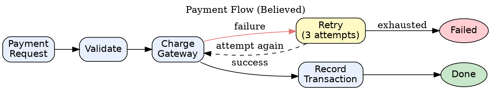

# DOT as Analysis

## Overview

DOT diagrams are not just documentation — they are analysis instruments. Drawing a system forces you to make structural claims. Those claims can be verified, and the gaps between belief and reality reveal bugs, missing paths, and hidden coupling.

**Core principle:** Completeness pressure is the mechanism. You cannot leave a box disconnected without asking why. You cannot draw a flow without tracing where it actually goes. The act of drawing forces reconciliation.

---

## The Reconciliation Workflow

A 4-phase process for using diagrams to surface system truth:

### Phase 1: Introspect

Write down what you believe the system does. List the components, the flows, the states. Do not look at the code yet. This captures your current mental model.

### Phase 2: Represent

Draw your belief as a DOT diagram. Use the correct shape vocabulary (services as boxes, data stores as cylinders, decisions as diamonds). Every node must connect to something — floating nodes are a forcing function.

### Phase 3: Reconcile

Read the actual code, configs, and logs. For each element in your diagram, verify it exists and behaves as drawn. Fill in the findings table:

| Element | Believed | Actual | Status | Issue |
|---------|----------|--------|--------|-------|
| Auth Service | validates JWT | delegates to external | WRONG | undocumented dependency |
| Retry logic | 3 attempts | no retry | MISSING | silent data loss possible |
| DB connection | pooled | new conn per request | WRONG | performance risk |
| Event queue | async | synchronous call | WRONG | blocking main thread |
| Cache layer | present | not implemented | MISSING | latency assumption invalid |
| Error path | logged | swallowed | WRONG | debugging blind spot |

### Phase 4: Surface

Update the diagram to reflect reality. The delta between Phase 2 and Phase 4 is your finding report. Each discrepancy is a candidate bug, design debt, or documentation gap.

---

## Anti-Rationalization Table

When reconciling, these thoughts will arise. Resist them:

| Rationalization | Correction |
|-----------------|------------|
| "That path probably exists, I'll add it anyway" | Only draw what you can verify. Unverified paths are hypotheses, not facts. |
| "The diagram is close enough" | Close enough hides the discrepancy. Draw the delta explicitly. |
| "It works in practice so the diagram doesn't matter" | If it works differently than drawn, the diagram is wrong. Fix the diagram or document the reason. |
| "That component is internal, I don't need to show it" | Hidden internals are where bugs live. Show it. |
| "The error path is obvious, I'll skip it" | Error paths are where the interesting failures happen. Draw them explicitly. |
| "That's just infrastructure, not worth diagramming" | Infrastructure failures are system failures. Include it. |
| "I'll add the legend later" | Legends are added before sharing, not after. A diagram without a legend is ambiguous. |

---

## When to Use

### High value (use this skill):

- Debugging a system you haven't touched in months
- Onboarding to an unfamiliar codebase
- Pre-incident review — mapping what you assume before an outage changes your assumptions
- Architecture review — validating that the implementation matches the design
- Before refactoring — drawing the current state reveals coupling you'd otherwise miss

### Low value (skip this skill):

- Simple single-function scripts
- Well-understood systems with up-to-date documentation
- UI-only changes with no service interactions
- Throwaway scripts

---

## Example: Reconciliation-Driven Bug Discovery

**Scenario:** A developer believed a payment service retried failed transactions. They drew the believed flow:

**After reconciliation:** The retry node did not exist. Charge failures went directly to a log entry and returned an error to the caller. The caller had no retry either. The discrepancy revealed that a production outage during a transient gateway failure had silently dropped transactions.

**Outcome:** The diagram delta — one missing retry node and two missing edges — became the bug report. The fix was targeted because the analysis was precise.
