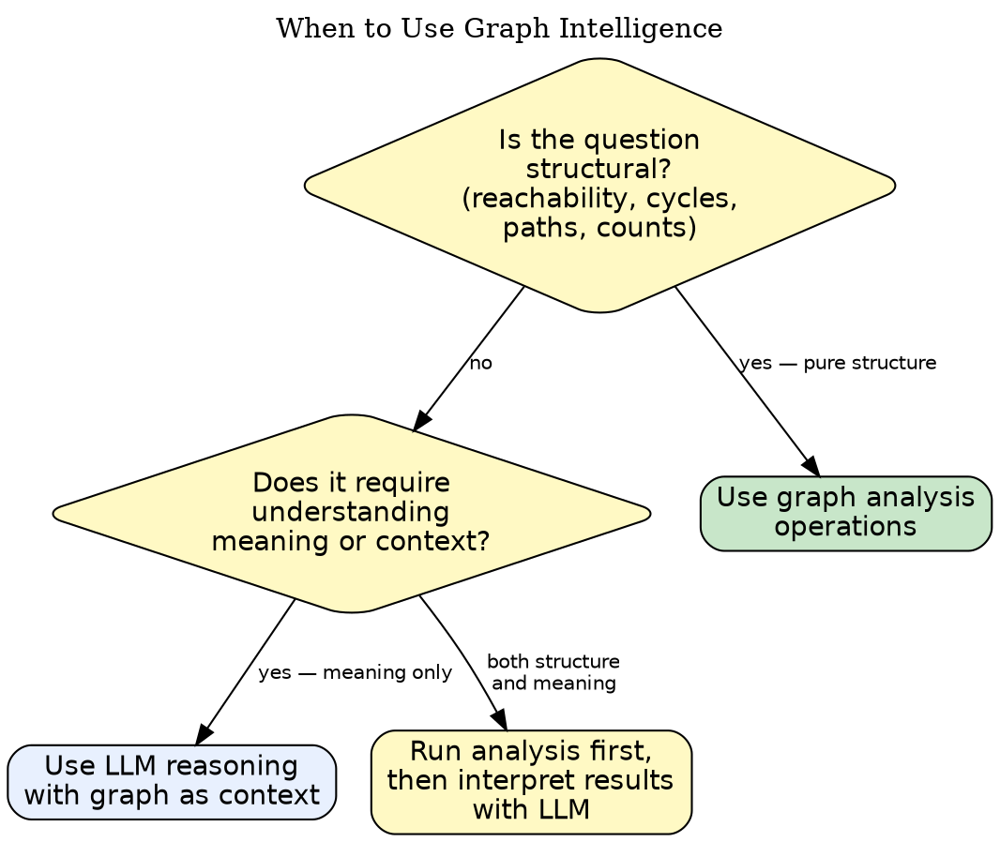

# DOT Graph Intelligence

## Overview

Structural questions about graphs — "is this node reachable?", "are there cycles?", "what changed?" — are code problems, not language model problems. Graph analysis tools answer these in milliseconds with zero ambiguity. Reserve LLM reasoning for interpretation, not computation.

**Core principle:** Code answers structural questions — that is code's judgment to make. LLMs interpret what the answers mean. Use the right tool for each layer.

---

## When to Use

---

## Operations Reference

| Operation | Question It Answers | Input | Output |
|-----------|--------------------|---------|----|
| `reachability` | Can node A reach node B? | source node, target node | yes/no + path |
| `unreachable` | Which nodes are isolated or stranded? | graph | list of unreachable nodes |
| `cycles` | Are there circular dependencies? | graph | list of cycle node sequences |
| `paths` | What are all paths between two nodes? | source, target | list of paths |
| `critical_path` | What is the longest path (bottleneck)? | graph (DAG) | ordered node list + length |
| `subgraph_extract` | What is the subgraph reachable from a node? | root node | subgraph DOT |
| `diff` | What changed between two versions? | graph A, graph B | added/removed nodes+edges |
| `stats` | How large and dense is this graph? | graph | node count, edge count, density |

---

## The Analysis Loop

A 7-step process for structured graph investigation:

1. **Define the question** — write it as a structural query before running any tool ("are there cycles in the dependency graph?")
2. **Select the operation** — match the question to the operations table above
3. **Run the operation** — use graph analysis tooling, not manual inspection
4. **Capture raw output** — save the result before interpreting it
5. **Interpret with context** — bring the result to LLM reasoning with the original diagram and question
6. **Update the diagram** — if the analysis reveals a structural issue, fix the diagram to reflect reality
7. **Re-run to verify** — confirm the fix resolves the original query

---

## Interpretation Guide

When analysis returns results, apply these patterns:

**Cycles detected:**
- In a dependency graph: circular dependency — likely a design problem
- In a state machine: valid if expected (loop states), invalid if unexpected
- In a data flow: data is being written back to a source it reads from — check for corruption risk

**Unreachable nodes found:**
- Dead code path — the node was never connected or was disconnected during refactoring
- Orphaned component — a service or module with no callers
- Forgotten placeholder — an intended node that was never wired up

**High density (edges >> nodes):**
- Everything-talks-to-everything pattern — high coupling, hard to isolate for testing
- Missing abstraction layer — consider introducing a coordinator or message bus

**Multiple disconnected components:**
- Expected if diagram covers independent subsystems
- Unexpected if diagram is supposed to show a single connected system — something is missing

---

## Code vs LLM Decision Matrix

| Task | Use Code | Use LLM |
|------|----------|---------|
| Count nodes in a graph | ✓ | |
| Check if path exists between two nodes | ✓ | |
| Find all cycles | ✓ | |
| Determine longest path | ✓ | |
| List unreachable nodes | ✓ | |
| Compare two graph versions (diff) | ✓ | |
| Extract subgraph from root | ✓ | |
| Calculate graph density | ✓ | |
| Explain why a cycle is a design problem | | ✓ |
| Suggest how to break a cycle | | ✓ |
