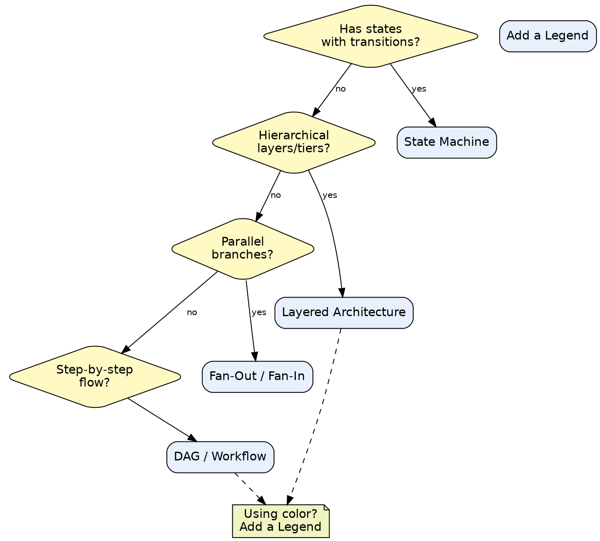
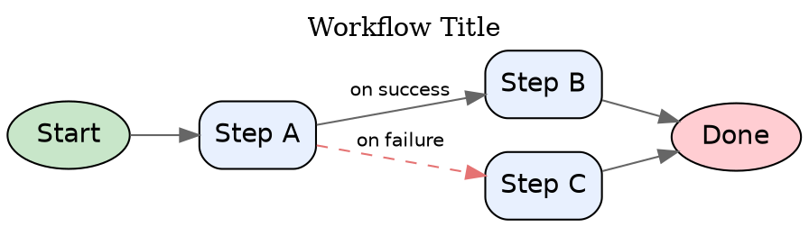
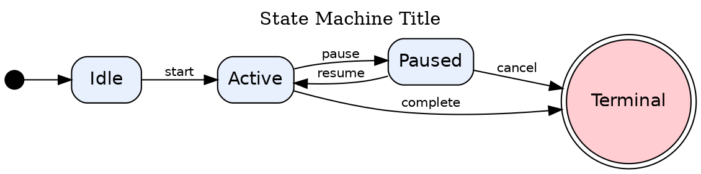
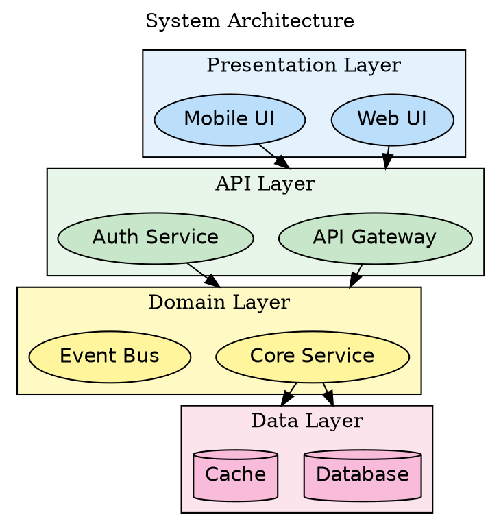
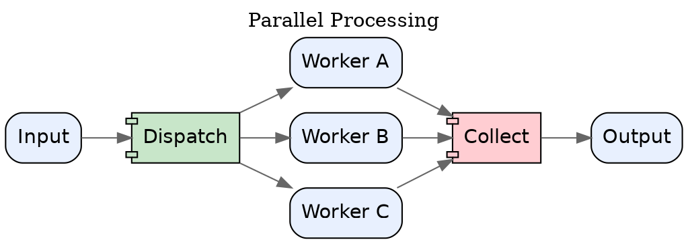
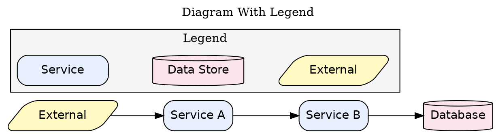

# DOT Pattern Templates

## Overview

Ready-to-use DOT templates for the most common diagram types. Each template is complete, renders correctly, and demonstrates the right shape vocabulary and layout choices. Copy, rename nodes, adjust labels.

**Core principle:** Start from a working pattern. Blank canvas invites bad defaults. Templates encode proven shape vocabulary, layout direction, and structural choices.

## Pattern Selection

How to choose the right template:

---

## Template 1: DAG / Workflow

Use for pipelines, CI/CD flows, processing steps, data pipelines.

---

## Template 2: State Machine

Use for lifecycle states, order status, connection states, document workflows.

---

## Template 3: Layered Architecture

Use for system architecture, n-tier applications, domain boundaries.

---

## Template 4: Fan-Out / Fan-In

Use for parallel processing, scatter-gather, map-reduce, worker pools.

---

## Template 5: Legend

Add to any diagram that uses color or non-obvious shapes.

---

## Template Checklist

Before submitting a diagram created from a template:

- [ ] Title set via `label=` and `labelloc=t` on the graph
- [ ] All node IDs replaced with meaningful names
- [ ] All `label=` values updated to real content
- [ ] Shape vocabulary matches what the node actually is (service, store, decision, etc.)
- [ ] Color is consistent and a legend is included if color carries meaning
- [ ] Diagram renders without errors: `dot -Tsvg diagram.dot > /dev/null`
